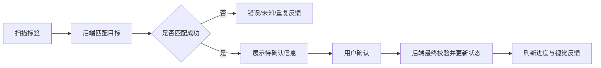

## 背景：一个抽象场景

在现场操作系统里，扫码常常承担“防错”的职责：操作人员扫描一个标签，系统判断它是否属于当前任务、是否已经处理、是否能进入下一步。看起来只是把条码送到后端验证，但真正影响体验和准确性的，是扫码之后的状态设计。

如果系统把“扫描匹配成功”直接等同于“操作完成”，流程会很快变得危险。因为扫码只能证明系统识别到了一个对象，却不能总是证明操作人员已经完成了现场确认。尤其是在站位、设备、工序、资源绑定这类场景里，扫码之后还需要用户确认目标位置、核对资源信息，才应该推进业务状态。

这次实践可以抽象成一个问题：**在高频扫码的移动端页面里，如何既保证操作顺畅，又避免误扫、重扫和跳过带来的状态污染？**


## 问题拆解

### 1. 扫描成功不等于流程完成

扫码流程里至少有三层状态：

- `matched`：条码匹配到了当前任务里的某个目标。
- `pendingConfirm`：用户需要核对目标信息并确认。
- `confirmed`：后端已接受确认动作并更新状态。

如果把这三层压成一个“成功”，就容易出现两个问题：

- 页面提示“已确认”，但用户其实还没核对现场位置。
- 后端已经推进状态，用户发现扫错时很难回退。

更稳的方式是把扫描结果展示为“待确认”。扫码成功后弹出确认信息，用户核对后再提交确认动作。这样多了一次点击，但换来了更清晰的责任边界：扫码负责识别，确认负责推进。



### 2. “跳过”按钮会削弱防错语义

防错流程的核心是：目标对象必须被识别、被核对、被确认。如果页面提供一个随手可点的“跳过”，系统就引入了一条绕开防错的路径。

不是所有场景都不能跳过，但跳过必须有明确的业务含义、权限边界和审计记录。如果只是为了让流程继续走，跳过按钮会让数据状态变得模糊：

- 这一步是真的不需要验证，还是用户临时跳过？
- 后续统计里它算完成、异常还是待处理？
- 再次进入页面时应该提示什么？

所以在强防错场景里，移除普通跳过按钮是合理的。用户可以取消弹窗、重新扫码，但不能把未确认对象伪装成已处理。

### 3. 重复扫描要有独立反馈

重复扫描不是普通错误。普通错误意味着“你扫错了”；重复扫描往往意味着“这件事已经做过了”。如果两者都用红色错误提示，现场用户会误以为出现了异常。

更好的反馈分层是：

- 未知对象：提示无法识别，给错误反馈。
- 不匹配对象：提示不属于当前任务，给错误反馈。
- 已完成对象：提示无需重复处理，给重复反馈。
- 匹配对象：进入待确认或直接确认成功，给成功反馈。

移动端可以把这些反馈拆成不同函数，避免所有异常都落到同一个 toast：

```js
function showScanFailureFeedback(message, reason) {
  if (reason === "REPEATED") {
    return showRepeatFeedback(message);
  }
  if (reason === "UNKNOWN") {
    return showUnknownFeedback(message);
  }
  return showErrorFeedback(message);
}
```

这类小拆分很值钱。它让用户能够通过颜色、声音、文案快速判断下一步该做什么，而不是每次都停下来读一段错误文本。


## 方案设计

### 移动端：把扫码动作拆成识别和确认

一个可复用的移动端扫描流程可以这样设计：

1. 防重入：如果当前正在请求，直接忽略新的扫码输入。
2. 清理旧弹窗：新扫码开始前关闭上一次确认弹窗，清空临时数据。
3. 调用后端匹配接口：只做识别和基础校验。
4. 成功后展示确认信息：目标位置、资源编码、名称、数量等。
5. 用户确认后提交最终确认接口。
6. 成功后刷新进度、播放反馈、继续扫码。

简化代码如下：

```js
async function handleScan(code) {
  if (state.loading) return;
  state.loading = true;
  state.confirmVisible = false;
  state.confirmData = null;

  try {
    const result = await api.matchScanTarget({ code, taskId: state.taskId });
    if (!result.success) {
      return showScanFailureFeedback(result.message, result.reason);
    }

    state.confirmData = {
      targetName: result.targetName,
      positionText: result.positionText,
      resourceCode: result.resourceCode,
    };
    state.confirmVisible = true;
  } finally {
    state.loading = false;
  }
}

async function confirmScan() {
  await api.confirmTarget({
    taskId: state.taskId,
    targetId: state.confirmData.targetId,
  });
  state.confirmVisible = false;
  await refreshProgress("confirm");
  showSuccessFeedback("确认成功");
}
```

这里的关键点是：扫码请求不直接改变最终状态，确认请求才推进状态。这样页面行为和业务语义是一致的。

### 后端：校验顺序要贴近用户意图

后端校验不仅要完整，还要注意顺序。因为同一个扫码输入可能同时触发多个校验条件，而用户最终看到的只是一条提示。

例如，一个对象已经处理过，同时它也可能不在当前待处理集合里。如果后端先判断“不在待处理集合”，用户会看到“对象不匹配”；但从现场操作视角看，更有用的提示是“已完成，无需重复扫描”。

一个更贴近用户意图的顺序可以是：

```java
public ScanResult verifyScan(ScanCommand command) {
    Resource resource = resourceRepository.findByCode(command.getCode());
    if (resource == null) {
        return ScanResult.unknown("未识别到资源");
    }

    ProcessRecord record = recordRepository.findByTaskAndResource(
        command.getTaskId(), resource.getId());
    if (record != null && record.isConfirmed()) {
        return ScanResult.repeated("该资源已确认，无需重复扫描");
    }

    if (record == null) {
        return ScanResult.failed("资源不属于当前任务");
    }

    validateOperationContext(command, resource, record);
    return ScanResult.matched(record);
}
```

这不是放松校验，而是让错误信息更符合用户的真实动作：先回答“有没有这个资源”，再回答“是不是已经做过”，最后回答“能不能在当前上下文处理”。

### 状态展示：把“待取料、待确认、已完成”说清楚

移动端页面上不要只展示“成功/失败”。现场流程往往还需要展示更细的中间态，例如待取料、待确认、已完成、异常等。

这些状态不是为了好看，而是为了降低用户记忆负担。用户扫完一个对象后，页面应该立刻告诉他：

- 当前对象是否已识别。
- 是否还需要人工确认。
- 目标位置或站位是什么。
- 是否可以继续扫描下一个。

状态文案要和真实流程一致。比如扫码后还没确认，就不要写“已确认”；自动确认成功后，就不要继续提示“请确认上机”。文案错位会让用户失去对系统反馈的信任。

## 旁支经验：Web 端可配置表格和标签设计器

同一天的 Web 改动里，有表格列宽/列序拖拽、标签设计器上下边界线拖拽、打印边界规范化等优化。它们和 PDA 扫描不是同一个功能，但背后有相同的体验原则：**把系统状态以可理解、可调整、可预期的方式呈现给用户。**

表格拖拽解决的是高频管理页面的扫描效率；标签边界线解决的是设计器里“屏幕所见”和“打印所得”的一致性。这些细节不会改变核心业务状态，但会明显影响操作人员对系统的掌控感。


## 常见坑

### 1. 扫码后立即改最终状态

如果现场还需要人工核对，扫码后直接确认会让误扫成本变高。建议把扫码匹配和最终确认拆开。

### 2. 所有失败都显示同一种错误

未知、错扫、重复、已完成是不同反馈。移动端应该用不同文案和反馈方式指导下一步动作。

### 3. 新扫码没有清理旧弹窗

连续扫码时，如果不先关闭旧弹窗、清空旧确认数据，就可能把上一次的目标信息带到下一次确认里。

### 4. 后端校验顺序只按代码方便排列

校验顺序会影响用户看到的错误原因。高频现场流程里，应优先返回最能指导用户行动的信息。

## 可复用经验

设计移动端扫描防错流程时，可以用下面这张清单自查：

1. 扫描匹配和最终确认是否拆开？
2. 是否移除了没有审计语义的跳过路径？
3. 重复扫描是否有独立反馈？
4. 扫描前是否防重入并清理旧弹窗状态？
5. 后端是否优先返回对用户最有帮助的失败原因？
6. 页面文案是否准确区分“待确认”和“已确认”？
7. 成功后是否刷新进度并允许继续扫码？
8. 已完成记录是否能阻断重复操作？

## 总结

移动端扫描防错的核心，不是把条码扫进去，而是让系统在高频、弱网、容易误操作的现场环境里，把每一步状态说清楚、校验准、反馈快。

这次实践的经验可以概括为三句话：扫码只负责识别，确认才推进状态；重复不是普通错误，要给用户明确反馈；后端校验顺序要服务现场动作，而不只是服务代码结构。做到这些，扫描流程才会既顺手，又真的防错。

