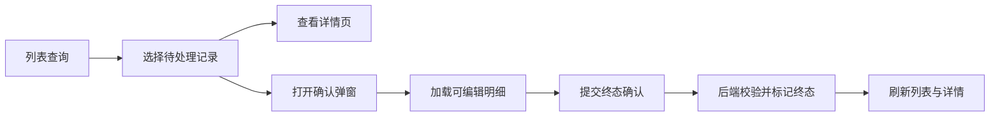

## 背景：一个抽象场景

很多业务系统里都会有一种“终态操作”：确认某个任务结束、关闭某个流程、冻结某批数据、结算某段执行结果。它看起来只是列表上的一个按钮，但真正落到系统设计里，往往会牵动列表筛选、详情展示、确认弹窗、明细编辑、状态标记、后端校验和后续查询。

终态操作的危险之处在于，它通常不可轻易回退。一旦确认，系统会认为这一段流程已经完成，后续页面不应该继续把它当作待处理对象，移动端或其他业务入口也不应该再允许它走原来的处理路径。

这次实践可以抽象成一个问题：**当一个流程从“进行中”进入“已结束”时，如何让 Web 端、后端和关联单据都对这个终态形成一致理解？**


## 问题拆解

### 1. 终态不是一个页面字段，而是一条业务边界

很多系统一开始会给主对象加一个布尔字段，例如 `closed`、`finished`、`ended`。字段本身没有问题，但如果只把它当作页面展示值，就会漏掉更关键的含义：

- 列表查询要能区分待结束和已结束。
- 详情页面要展示进入终态时的依据。
- 确认操作要校验当前状态是否仍允许结束。
- 关联明细要在终态时固化或计算。
- 其他流程再操作时要识别“已结束”并阻断。

所以终态字段不是装饰，它代表一条业务边界。边界一旦建立，就必须进入后端查询、保存、响应、分页过滤和错误码体系。

### 2. 弹窗适合确认，页面适合承载详情

终态流程常见的交互是：列表选择一条记录，点击确认按钮，弹出明细编辑窗口，然后提交。这个方式适合轻量确认，但如果明细较多、需要分组展示、需要查看历史信息或跨页面分享，就应该把“详情”从弹窗升级为独立页面。

弹窗和页面可以这样分工：

- 列表页负责检索、选择、触发动作。
- 详情页负责承载完整上下文和只读信息。
- 确认弹窗负责最后一次可编辑确认。
- 后端接口负责返回权威明细与提交结果。

这样做的好处是，页面层次更清晰：用户想“看清楚”就进详情页，想“执行终态动作”才进入确认弹窗。



### 3. 前端类型定义是接口契约的一部分

这类功能通常会新增一组前端 API 类型：列表响应、详情响应、明细响应、确认请求。它们不只是 TypeScript 辅助，而是前后端契约在前端侧的投影。

一个脱敏后的类型可以这样表达：

```ts
export interface TerminalFlowItem {
  taskId: number;
  taskNo: string;
  relatedOrderIds: number[];
  completedCount: number;
  totalCount: number;
  canClose: boolean;
  closed: boolean;
}

export interface TerminalConfirmRequest {
  taskId: number;
  items: Array<{
    detailId: number;
    actualQty: number;
  }>;
}
```

这里有两个字段很关键：`canClose` 和 `closed`。前者表达“当前是否允许执行终态动作”，后者表达“是否已经进入终态”。一个是动作权限，一个是事实状态，不能混用。


## 方案设计

### 后端：先建模，再暴露接口

终态流程的后端建设通常可以分成四层：

1. 请求/响应模型：分页条件、详情响应、明细响应、确认请求。
2. 控制器接口：分页查询、详情获取、明细获取、确认终态。
3. 业务服务：判断是否允许结束、计算明细、更新终态标记。
4. 关联对象扩展：在原有对象上增加终态字段和查询条件。

一个简化后的后端服务形态如下：

```java
@Transactional(rollbackFor = Exception.class)
public void confirmTerminalState(TerminalConfirmCommand command) {
    Task task = taskRepository.lockById(command.getTaskId());
    requireVisible(task);
    requireNotClosed(task);
    requireAllRequiredStepsCompleted(task);

    List<Detail> details = detailRepository.selectByTaskId(task.getId());
    validateActualQty(command.getItems(), details);
    applyActualResult(command.getItems(), details);

    task.markClosed();
    taskRepository.update(task);
}
```

终态确认一定要由后端做最终判断。前端可以用 `canClose` 控制按钮，但提交时后端仍要重新校验，因为页面数据可能已经过期，其他端也可能刚刚修改了同一流程。

### Web：列表、详情、确认动作拆开

Web 端的实现重点不是把页面堆出来，而是把用户路径拆清楚。

列表页应该解决“找得到”和“选得准”：

- 支持按终态字段过滤。
- 展示是否可结束、是否已结束。
- 行点击和单选状态保持一致。
- 提交成功后刷新列表并清理选中状态。

详情页应该解决“看得完整”：

- 根据路由参数加载权威详情。
- 展示关联对象和明细统计。
- 使用独立页面承载较长内容，避免弹窗滚动过深。

确认弹窗应该解决“改得谨慎”：

- 打开时重新拉取可编辑明细。
- 按关联对象或类型分组展示。
- 提交时只传最小必要字段。
- 成功后关闭弹窗并通知父页面刷新。

### 状态字段：写入原对象，而不是只存在新模块

终态模块可以是一个新入口，但终态字段最好回写到原有核心对象上。原因很简单：其他模块查询这个对象时，也需要知道它是否已经结束。

如果终态状态只存在新模块内部，就会形成两个事实源：

- 新模块认为流程已经结束。
- 原模块仍认为对象可继续操作。

更稳的方式是让原对象拥有终态字段，并在分页请求、响应 VO、保存请求中显式传递。这样列表、详情、导出、关联查询和后续校验都能基于同一个事实状态。


## 旁支经验：硬件报文也需要契约演进

同一天还有一条偏底层的优化：硬件亮灭灯指令支持单点和范围混合报文，并增加了压缩逻辑测试。它和终态流程看似无关，但背后是同一个工程思想：**契约变化要兼顾表达能力、兼容性和验证手段。**

如果一个设备指令里既有离散点位，又有连续范围，直接逐点下发会造成报文过大；只支持范围又表达不了零散点位。因此更合理的结构是同时支持 `cells` 和 `cellRanges`，让压缩器根据点位分布决定报文形态。

抽象后可以理解为：

```java
PackedCells pack(List<Integer> cells) {
    List<Range> ranges = findContinuousRanges(cells);
    List<Integer> singles = findSingles(cells, ranges);
    return new PackedCells(singles, ranges);
}
```

这类底层契约一旦演进，单元测试很重要。因为压缩规则不像页面交互那样容易肉眼验证，必须用边界样例覆盖单点、连续范围、混合范围和空输入。

## 常见坑

### 1. 把 `canClose` 当成 `closed`

`canClose` 是当前是否允许执行动作，`closed` 是是否已经进入终态。一个对象可能暂时不能关闭，但也还没有关闭；也可能已经关闭，此时按钮当然也不能再点。两个概念混在一起，会导致列表筛选和按钮权限都变得混乱。

### 2. 只在前端禁用按钮

按钮禁用只能改善体验，不能保护数据。终态确认必须在后端事务里重新判断状态、权限、明细和数量。

### 3. 详情仍塞在列表弹窗里

轻量详情可以用弹窗，但当信息量变大、需要路由跳转、刷新或复用时，独立详情页更好维护。弹窗应该留给短流程确认。

### 4. 原对象没有终态字段

新模块自己能查到“已结束”还不够。原对象、关联列表、分页条件和后续业务校验都需要同一个终态字段，否则系统会出现多个事实源。

## 可复用经验

设计终态流程时，可以用这张清单做自查：

1. 终态字段是否写入核心对象，而不是只存在派生模块？
2. `canClose` 和 `closed` 是否分开表达？
3. 列表、详情、确认弹窗的职责是否清楚？
4. 确认提交是否只传最小必要字段？
5. 后端是否在事务内重新校验状态和明细？
6. 提交成功后，前端是否刷新列表并清理选中状态？
7. 已终态对象是否会阻断其他入口的继续操作？
8. 契约变化是否有类型定义、错误码和测试支撑？

## 总结

终态流程不是一个按钮，也不是一个字段，而是一套跨页面、跨接口、跨对象的状态闭环。它需要前端把列表、详情、确认动作拆清楚，也需要后端把请求模型、响应模型、终态字段、业务校验和错误码补齐。

真正可靠的设计，是让所有入口都承认同一个事实：这个流程是否已经结束、当前是否允许结束、结束时依据哪些明细。只要这三个问题回答清楚，终态功能就不会变成散落在页面里的临时逻辑，而会成为系统状态模型中稳定的一环。

