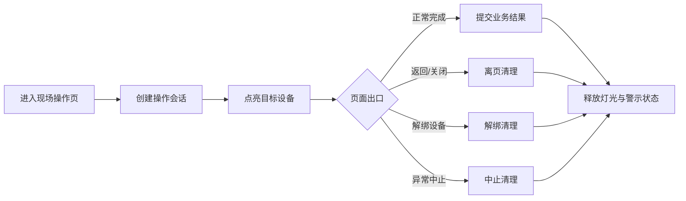

## 背景：一个抽象场景

在纯软件系统里，页面离开通常只需要清理定时器、取消订阅、释放音频资源或停止扫码监听。但在带硬件协同的现场操作系统里，页面状态还会影响真实设备：指示灯是否亮起、警示灯是否闪烁、某个操作会话是否仍占用硬件资源。

这类系统的难点在于，移动端页面生命周期和硬件状态生命周期并不天然一致。用户可能正常完成任务，也可能直接返回、切换应用、关闭页面、解绑设备，甚至在弱网下重复进入同一个流程。如果只在“完成”按钮里做清理，就会留下一个隐患：业务流程已经结束或中断，但现场设备仍保持上一次的提示状态。

这次实践可以抽象为一个问题：**当移动端操作会点亮外部设备时，如何保证离开页面、完成流程、解绑资源后都能可靠释放硬件状态？**


## 问题拆解

### 1. 硬件状态也是一种资源占用

指示灯和警示灯看起来只是反馈，但在系统设计上，它们更像一种“外部资源占用”。一旦亮灯，就意味着系统告诉现场人员：这里有当前任务需要处理。

如果清理不及时，会带来几个问题：

- 现场人员被过期灯光误导。
- 下一个任务进入同一设备时，无法判断灯光属于哪个会话。
- 多个流程共用硬件时，前一个流程残留状态会污染后一个流程。
- 移动端已经释放页面，但后端或设备仍保留旧会话。

所以硬件状态不应该只被当成 UI 效果，而应该被纳入资源生命周期：创建、使用、释放、失败补偿。

### 2. 只在成功路径清理是不够的

很多流程一开始会在“提交成功”后调用灭灯接口，这能覆盖最理想的路径。但现场移动端最常见的恰恰是非理想路径：

- 用户扫到一半返回上一页。
- 页面被系统回收。
- 操作人员重新绑定另一个设备。
- 流程中止，但没有进入完成回调。
- 网络请求失败，页面仍继续离开。

因此清理动作需要挂在多个出口上，而不是只挂在成功按钮上。移动端至少要考虑页面卸载、流程完成、解绑、中止这几类出口。



### 3. 前端清理要尽力而为，后端清理要幂等

移动端页面卸载时发起请求，并不能保证一定成功。尤其是在 App、H5、PDA 混合环境里，页面生命周期回调执行时间有限，网络也可能已经不可用。

这意味着移动端清理应该是“尽力触发”，不能把它设计成一个强事务步骤。前端可以做这些事：

- 判断是否处于智能设备场景。
- 判断是否有会话 ID、设备 ID、任务 ID 等最小清理参数。
- 在离页、完成、解绑时调用清理接口。
- 捕获异常并记录日志，避免清理失败阻断页面退出。

一个抽象后的移动端写法可以是：

```js
function cleanupDeviceStateOnLeave() {
  if (!state.isSmartDevice || !state.deviceId || !state.sessionId) {
    return Promise.resolve();
  }

  return api.releaseDeviceState({
    deviceId: state.deviceId,
    sessionId: state.sessionId,
    taskId: state.taskId,
  }).catch(error => {
    console.error("[operation] release device state failed", error);
  });
}

onUnload(() => {
  cleanupDeviceStateOnLeave();
  stopScan();
  unsubscribeMessages();
  clearTimers();
});
```

这里的重点是：清理失败不能阻止页面退出，但后端必须允许重复调用。因为同一个清理动作可能同时来自离页、完成、解绑，也可能因为弱网重试被调用多次。


## 方案设计

### 移动端：把清理放进页面生命周期

移动端页面通常会维护多种外部连接：扫码监听、消息订阅、刷新定时器、音频反馈、硬件灯光。清理顺序可以按“外部影响优先”的原则处理：

1. 先释放现场设备状态，减少对真实环境的误导。
2. 再停止扫码监听，避免页面离开后继续响应硬件按键。
3. 取消消息订阅，避免后续通知更新已卸载页面。
4. 清理定时器和音频资源。

如果流程存在“完成后自动返回”，完成回调里也要调用同一个清理函数，而不是复制一份类似逻辑。这样离页和完成路径共享同一套释放语义。

### 后端：用会话隔离灯光状态

硬件清理接口不能只知道“关掉某个设备”，还需要知道“关掉哪个操作会话产生的状态”。否则两个用户或两个流程同时使用同一设备时，一个流程离开可能误关另一个流程的灯。

更稳的模型是给每次亮灯分配一个 `sessionId`，后续清理也携带这个会话标识：

```java
public void releaseDeviceState(ReleaseCommand command) {
    if (command.getDeviceId() == null || command.getSessionId() == null) {
        return;
    }

    deviceApi.lightDown(new LightDownRequest()
        .setDeviceId(command.getDeviceId())
        .setClearSession(command.getSessionId()));

    deviceApi.setAlertStatus(new AlertStatusRequest()
        .setDeviceId(command.getDeviceId())
        .setSessionId(command.getSessionId())
        .setStatus(AlertStatus.DISABLED));
}
```

这个例子保留了关键原则：按会话灭灯，而不是无条件清空设备。清理接口即使被重复调用，也应该返回成功或安全结束，因为“已经关掉”本身就是目标状态。

### 抽公共服务：避免每个业务各写一套灭灯

同一天的后端改动里，一个重要方向是把整架灭灯能力沉淀成公共支持服务。这个抽象非常有必要，因为硬件控制常常跨越多个业务流程：移动、拣选、交接、绑定、解绑，每个流程都可能需要亮灯和灭灯。

如果每个 Service 都直接拼装硬件 API 参数，后续会出现大量重复问题：

- 颜色、闪烁、场景类型不一致。
- 日志格式不一致。
- 异常处理策略不一致。
- 有的流程按设备灭灯，有的流程按会话灭灯。
- 新增一种硬件协议时，需要改很多业务类。

公共服务可以把底层硬件差异包起来，对业务暴露更稳定的方法：

```java
public class DeviceLightSupport {
    public void clearBySession(Long deviceId, String sessionId) {
        try {
            hardwareGateway.lightDown(deviceId, sessionId);
            hardwareGateway.disableAlert(deviceId, sessionId);
        } catch (Exception ex) {
            log.warn("clear device light failed, deviceId={}, sessionId={}", deviceId, sessionId, ex);
        }
    }
}
```

业务层只表达“我要释放这个会话占用的设备状态”，至于具体调用哪个硬件接口、如何处理警示灯、是否需要整架灭灯，都交给支持服务统一处理。


## 关键实现细节

### 1. 清理接口应该允许缺省场景安全返回

不是所有页面都绑定了智能设备。移动端调用清理前会做判断，后端也应该接受“没有可清理内容”的场景安全结束。这样可以减少前后端因为状态差异产生的报错。

### 2. 清理失败不应阻断主流程

硬件清理很重要，但它通常不是业务数据提交的事务组成部分。如果数据已经保存成功，灭灯失败应该记录日志并进入补偿路径，而不是回滚业务结果。否则用户会看到“操作失败”，但实际上业务数据已经完成。

### 3. 警示灯和指示灯要同时纳入释放

很多系统只关注格口灯、位置灯，却忘了警示灯。现场设备往往有多种提示状态：位置指示、整架警示、声音提醒、闪烁状态。释放时要检查是否存在多种硬件状态，否则会出现“位置灯灭了，但警示灯还亮着”的半释放状态。

### 4. 前端 API 封装要跟页面语义一致

移动端 API 方法名最好表达页面语义，例如 `releaseOnLeave`、`abortOperation`、`turnOffAlert`。这样页面调用时能看出它属于“离页清理”“中止清理”还是“单纯关闭警示”。接口路径和内部实现可以抽象，但前端调用语义要清楚。

## 可复用经验

类似的现场硬件协同流程，可以用下面这张清单做设计评审：

1. 每次亮灯是否有会话标识？
2. 灭灯是否按会话清理，避免误关其他流程？
3. 页面离开、正常完成、解绑、中止是否都会释放硬件状态？
4. 清理接口是否幂等，重复调用是否安全？
5. 清理失败是否只记录和补偿，而不误伤主业务结果？
6. 指示灯、警示灯、闪烁状态是否都被释放？
7. 公共硬件服务是否屏蔽了底层协议差异？
8. 移动端是否同时清理扫码监听、消息订阅、定时器和音频资源？

## 总结

移动端和硬件设备协同时，页面不再只是页面，它会占用真实世界里的资源。只要系统点亮了某个设备，就必须认真设计它什么时候释放、由谁释放、重复释放是否安全、失败后如何补偿。

这次实践的核心经验是：把硬件状态当作资源，把亮灯动作会话化，把离页和完成路径统一到同一个清理函数，把后端灭灯能力沉淀成公共服务。这样即使多个移动端流程同时接入同一类设备，也能保持现场状态可控、接口职责清晰、异常路径不失控。

