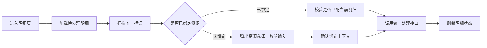

## 背景：一个抽象场景

在现场操作系统里，扫码通常不是一个简单输入框，而是业务状态流转的触发器。

一个移动端页面可能需要处理这些动作：扫描唯一标识、判断对象是否已绑定、选择待处理资源、录入数量、提交处理结果、刷新明细、提示重复操作。Web 端负责维护基础数据和规则配置，后端则承担权限校验、状态计算、数据落库和并发保护。

如果把所有动作都塞到一个列表页入口里，页面会很快变成“既要查询、又要选择、还要提交”的混合体。入口越靠前，缺少的上下文越多，移动端为了补齐上下文就会不断增加弹窗、临时字段和分支判断，最后形成一种常见问题：**页面看起来能操作，但每一步到底依赖哪个状态并不清楚。**

这次实践可以抽象成一个问题：在移动端高频扫码场景中，如何让扫码入口、后端接口和页面状态机保持同一个节奏？


## 问题拆解

### 1. 入口位置决定了上下文质量

列表页适合做筛选、汇总和批量选择，但不一定适合承载强状态操作。因为列表页通常只有单据摘要，缺少明细级字段，例如资源 ID、已处理数量、缺口数量、绑定状态等。

如果在列表页直接支持扫码确认，就容易出现三个问题：

- 页面需要先选择一个上层对象，再补充明细对象。
- 扫码结果与当前列表项之间缺少天然关联。
- 提交接口不得不接收更多兜底参数，后端再做二次猜测。

更稳的方式是把扫码动作收敛到明细页。明细页已经拥有当前任务的完整上下文：待处理明细、已处理明细、可选资源、数量差异和页面状态。移动端可以先展示候选项，再让用户确认绑定或处理对象，后端只负责校验最终动作是否仍然合法。

### 2. 独立确认接口容易扩大职责

在初版设计里，扫码查询和扫码确认常常会被拆成两个专用接口：一个接口返回唯一标识的绑定状态，另一个接口直接完成确认。这个设计在简单场景里很顺，但当流程需要支持“空标识首次绑定”“已绑定对象累加”“明细缺口校验”“重复扫码提示”时，确认接口会迅速膨胀。

问题不在于接口数量多，而在于确认接口承担了太多语义：

- 判断唯一标识是否存在。
- 判断是否已经绑定资源。
- 判断是否需要首次绑定。
- 校验本次处理数量。
- 修改对象当前数量。
- 推动上层任务状态。

当一个接口同时做查询、绑定、累加和状态推进，前端很难知道失败原因属于哪一层，后端也很难保证它始终只被正确页面调用。

这次调整的思路是收敛职责：扫码查询只回答“这个唯一标识当前是什么状态”；真正的数量变更复用已有的处理接口；需要用户选择资源时，由明细页弹窗完成上下文补齐。



### 3. 明细字段是前后端契约的一部分

移动端要在明细页完成资源选择，就不能只拿到展示字段。编码、名称、规格、单位这些信息能帮助用户识别对象，但程序真正需要的是稳定的明细标识和资源标识。

很多扫码流程的缺陷都来自“展示字段足够，人机交互也能看懂，但程序决策缺少稳定 ID”。例如同一种资源可能出现在多个明细里，名称相同但数量缺口不同；如果只按编码或名称匹配，就可能把本次扫码挂到错误明细上。

因此，后端返回明细摘要时，需要把前端决策所需的最小标识补齐：

```java
public class DetailSummaryItem {
    private Long detailId;
    private Long resourceId;
    private String resourceCode;
    private BigDecimal requiredQty;
    private BigDecimal processedQty;
    private BigDecimal shortageQty;
}
```

这里的重点不是字段越多越好，而是**展示字段和决策字段要分开看**。展示字段服务用户识别，决策字段服务程序建立稳定关联。只要前端要做选择、过滤、去重或提交，就应该优先依赖不可歧义的 ID。


## 方案设计

### 移动端：把扫码建成小状态机

扫码页面可以用状态机来拆，而不是在一个方法里堆满条件判断。一个简化模型如下：

- `idle`：等待扫码。
- `scanning`：扫码监听中。
- `querying`：根据唯一标识查询后端状态。
- `binding`：唯一标识未绑定，需要用户选择资源和数量。
- `submitting`：提交处理动作。
- `done`：刷新明细并给出反馈。
- `error`：展示错误并允许继续扫码。

对应到代码，可以把“扫码解析”“重复判断”“弹窗选择”“提交处理”拆成可组合步骤：

```js
async function handleScan(rawText) {
  const code = normalizeScanText(rawText);
  if (processedCodes.has(code)) {
    return showRepeat("该标识已经处理过");
  }

  const label = await queryCodeState(code);
  if (label.status === "UNBOUND") {
    return openBindDialog({ code, candidates: unprocessedItems });
  }

  const target = matchDetail(label.resourceId, unprocessedItems);
  if (!target) {
    return showError("当前任务中没有可匹配的待处理对象");
  }

  await submitProcess({ detailId: target.detailId, code, qty: target.shortageQty });
  await reloadSummary();
}
```

这个示例故意没有写具体业务字段。真正重要的是流程顺序：先标准化扫码内容，再做本地短路防重，然后查询后端权威状态，最后基于明细上下文提交动作。

### 后端：查询接口只表达事实，处理接口负责落库

后端接口职责可以这样划分：

- 扫码查询接口：返回唯一标识是否存在、是否绑定、当前数量、关联资源等事实。
- 明细摘要接口：返回当前任务下可处理对象、已处理对象和缺口数量。
- 处理提交接口：校验明细、数量、权限、状态和并发条件，并完成落库。

这样拆分后，移动端不会把“查到什么”误当成“已经处理成功”，后端也不会在一个确认接口里同时处理过多路径。

提交接口仍然必须保持权威校验。例如：

```java
@Transactional(rollbackFor = Exception.class)
public void submitProcess(ProcessCommand command) {
    TaskDetail detail = detailRepository.lockById(command.getDetailId());
    requireVisible(detail.getTaskId());
    requirePositive(command.getQty());
    requirePending(detail);
    requireQtyNotExceed(command.getQty(), detail.getShortageQty());

    labelService.bindIfNecessary(command.getUniqueCode(), detail.getResourceId());
    detail.addProcessedQty(command.getQty());
    taskService.refreshTaskStatus(detail.getTaskId());
}
```

移动端可以做体验层校验，但后端不能假设移动端一定正确。尤其是扫码场景里，重复扫码、弱网重试、页面停留过久、另一个端已处理等情况都很常见，最终状态必须在事务边界内重新判断。

### Web 端：校验前移，但不替代后端规则

同一天的其他改动里，也能看到类似思想：表单必填校验、导入失败提示收敛、编码归一化匹配、权限和状态回退等。这些看起来是零散小修，但共同点都是让系统在多入口下保持一致。

Web 端适合做三类前置处理：

- 输入格式校验，让用户更早发现明显错误。
- 导入数据清洗，例如去除空格、统一大小写、过滤无效选项。
- 交互反馈收敛，避免同一个错误被多处重复弹出。

但后端仍要保留同样的核心规则。前端校验负责减少低级错误，后端校验负责保护系统边界。


## 常见坑

### 1. 把“扫码成功”当成“处理成功”

扫码成功只说明移动端拿到了一个字符串，不代表它能匹配当前任务，更不代表后端已经落库。页面文案和代码状态都应该区分 `scanned`、`matched`、`submitted`、`synced`。

### 2. 用展示字段做唯一匹配

编码、名称、规格都可能重复或变化。只要涉及提交，应该使用后端返回的明细 ID、资源 ID 或唯一标识建立关联。

### 3. 弹窗关闭时没有清理临时状态

移动端弹窗里常有搜索关键字、已选对象、输入数量和待提交数据。关闭弹窗时如果不清理，下一次扫码可能复用上一次状态，造成误提交。

### 4. 删除接口后忘记同步前端 API 封装

后端移除专用确认接口后，前端 API 模块也要同步清理。否则虽然页面不再调用，但残留封装会误导后续维护者，以为仍然存在一条可用路径。

## 可复用经验

这类移动端扫码流程，可以用一张清单来约束设计：

1. 扫码入口是否位于上下文最完整的页面？
2. 查询接口是否只返回事实，而不是顺手改变状态？
3. 提交接口是否在事务内重新校验权限、状态和数量？
4. 前端是否使用稳定 ID 做匹配，而不是展示字段？
5. 重复扫码、空码、未知码、已处理码是否有不同反馈？
6. 弹窗关闭、页面返回、连续扫码时是否清理临时状态？
7. 后端接口删除或收敛后，前端封装和页面调用是否同步移除？

## 总结

移动端扫码流程的复杂度，往往不是来自扫码本身，而是来自“扫码触发了一个真实业务状态变化”。当入口缺少上下文、接口职责过宽、前端匹配字段不稳定时，系统就会靠越来越多的分支逻辑维持运行。

更稳的做法是：把扫码放到明细上下文里，把页面逻辑建成小状态机，把后端接口拆成事实查询和权威提交，把明细 ID、资源 ID 这类决策字段纳入前后端契约。这样即使后续继续扩展空标识绑定、连续扫码、弱网重试或多端协作，也不会让流程失去边界。

