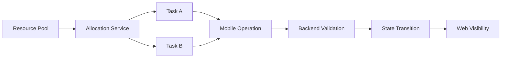

在一些复杂的业务系统里，同一份资源并不总是只服务于一个任务。它可能先被任务 A 占用，又在满足条件时被任务 B 临时复用；任务 A 结束后，这份资源还可能继续流转给任务 C，或者回到待处理池。

这个场景看起来只是“多加几个字段”的问题，但真正落到系统实现里，会同时影响后端分配逻辑、Web 管理端展示、PDA/移动端现场操作以及资源回收流程。如果没有统一的状态模型，最容易出现的问题是：后端已经做了复用判断，前端仍按普通资源展示；移动端提交时少传了下一个任务，后端不知道资源该流向哪里；回收时只按普通资源处理，导致部分设备状态或资源状态没有被正确释放。


本文用一个脱敏后的抽象案例，聊聊这类“共享资源分配”在多端协同系统中的设计思路。

## 背景：一个抽象案例

假设系统中有三类角色：

- 后端服务：负责资源分配、状态流转、回收和一致性校验。
- Web 管理端：负责展示任务明细、标记异常状态、提供重新分配入口。
- PDA/移动端：负责现场绑定、确认、扫码、回收等高频操作。

资源默认属于某一个任务，但在特定条件下可以被另一个任务临时使用。为了让系统知道“这份资源当前是正常分配，还是跨任务复用”，需要引入几个抽象概念：

- `shared`: 当前记录是否属于共享资源。
- `ownerTaskId`: 资源原始归属任务。
- `currentTaskId`: 资源当前服务任务。
- `nextTaskId`: 当前任务结束后，资源要继续流向的下一个任务。
- `sharedGroupId`: 多个任务围绕同一份资源形成的协作组。

问题的关键不是字段本身，而是这些字段在不同端之间如何保持一致。

## 问题拆解

这类需求通常会暴露出四个技术问题。

第一，资源分配不是单点动作，而是生命周期动作。  
如果只在“首次分配”时处理共享，后续的补充、回收、结束、转交都会变成例外分支。例外分支越多，状态越容易漂移。

第二，前端展示不能只显示“成功/失败”。  
共享资源和普通资源的风险不同。Web 端需要把“资源来自哪里、为什么被复用、是否需要重新分配”表达清楚；移动端则需要把“是否必须选择下一任务”放在提交前，而不是提交失败后才让用户猜。

第三，后端必须做最终校验。  
移动端可以做前置判断，但不能相信移动端一定传了正确参数。只要涉及资源归属、状态流转、重复提交，就必须以后端校验为准。

第四，回收动作要能按粒度处理。  
有些时候不能简单地“一键释放全部资源”，而是要支持按执行位置、按资源标识或按任务关系做局部释放。否则现场操作会被迫绕路，系统状态也更难恢复。

## 方案设计

可以把整个链路拆成三层：数据模型、服务编排、多端交互。



### 后端：用状态模型约束资源流转

后端不要只保存“资源属于哪个任务”，而要能表达“资源为什么属于这个任务”。普通占用和共享占用在业务上是两种状态，在技术上也应该拆开。

一个简化后的实体可以这样设计：

```java
public class ResourceAllocation {
    private Long id;
    private Long resourceId;
    private Long currentTaskId;
    private Long ownerTaskId;
    private Long sharedGroupId;
    private Boolean shared;
    private AllocationStatus status;
}
```

当系统自动分配资源时，不建议只做一次简单查询：

```java
Resource resource = resourceRepository.findFirstAvailable(resourceCode);
```

更稳妥的做法是把“普通可用资源”和“可共享资源”分成两个候选集，再按优先级合并：

```java
List<Resource> normalCandidates = resourceRepository.findAvailable(resourceCode);
List<Resource> sharedCandidates = resourceRepository.findShareable(resourceCode, currentTaskId);

List<AllocationPlan> plans = allocationPlanner.plan(
    currentTaskId,
    requiredQuantity,
    normalCandidates,
    sharedCandidates
);
```

这样服务层能明确知道每一条分配记录的来源，而不是事后再从状态里反推。

### Web 端：把隐性冲突变成可见信息

Web 管理端的价值不是重复后端逻辑，而是把复杂状态翻译成用户能理解的界面信息。

比如任务明细表里，普通资源和共享资源不能只靠同一个“正常”标签展示。可以把展示状态做成一个独立映射：

```ts
const allocationStatusView = {
  NORMAL: { label: '正常分配', type: 'success' },
  SHARED: { label: '共享占用', type: 'warning' },
  MISSING: { label: '待补充', type: 'danger' }
}
```

如果某条记录来自其他任务，页面可以展示一个抽象提示：

```ts
function getAllocationTip(row: AllocationRow) {
  if (!row.shared) {
    return '当前资源为普通分配'
  }
  return `该资源来自关联任务，可在详情中查看流转关系`
}
```

注意这里不要让前端拼接复杂业务判断。前端只消费后端给出的结构化字段，负责展示、跳转和触发操作。

### PDA/移动端：把现场操作变成明确选择

移动端的挑战是操作场景更紧凑，用户通常不适合阅读大段说明。对于共享资源这类有后续流向的动作，移动端最好把选择前置。

例如当前任务结束后，如果资源还可以继续给其他任务使用，就需要让用户选择下一站：

```ts
const candidates = sharedGroups
  .flatMap(group => group.nextTaskCandidates)
  .filter(item => item.enabled)

if (candidates.length > 0 && !selectedNextTaskId) {
  showToast('请选择资源后续流向')
  return
}
```

但这只是体验层校验。真正提交时，后端仍要重新判断：

```java
if (shareGroup.hasRemainingTasks() && request.getNextTaskId() == null) {
    throw new BizException("shared resource requires next task selection");
}
```

一个比较实用的原则是：移动端负责减少误操作，后端负责保证正确性。


## 关键实现：把“共享”做成服务能力，而不是散落在各处的 if

如果共享资源逻辑只写在某个接口里，后面一定会被其他流程绕开。更好的做法是把它沉淀成服务能力。

比如可以定义一个分配服务：

```java
public interface SharedAllocationService {

    boolean hasSharedAllocation(Long taskId);

    List<NextTaskOption> listNextTaskOptions(Long taskId);

    AllocationResult allocateWithSharedPolicy(Long taskId);

    void transferAfterFinish(Long taskId, Long nextTaskId);
}
```

这样 Web 端检查是否存在共享状态、PDA 获取下一任务候选、后端结束流程处理资源转移，都可以复用同一套语义。

服务内部再做阶段化处理：

```java
public AllocationResult allocateWithSharedPolicy(Long taskId) {
    TaskSnapshot snapshot = taskRepository.loadSnapshot(taskId);

    AllocationContext context = AllocationContext.from(snapshot);

    List<AllocationPlan> normalPlans = planNormalResources(context);
    List<AllocationPlan> sharedPlans = planShareableResources(context);

    AllocationResult result = allocationWriter.write(taskId, normalPlans, sharedPlans);

    taskStatusUpdater.refreshByAllocationResult(taskId, result);
    return result;
}
```

这里有两个重点：

- 先构建快照，再生成计划，最后统一写入，避免边查边改导致状态不稳定。
- 分配完成后刷新任务明细状态，让 Web 展示和后端真实分配保持一致。

## 回收与释放：不要忽略局部操作

共享资源的回收比普通资源更麻烦。普通资源通常只需要释放占用即可，但共享资源还要判断：

- 当前任务是否真的结束。
- 资源是否还有下一个任务。
- 是否只释放某个执行位置上的资源。
- 是否需要联动外部状态，比如设备提示、缓存状态或现场标识。

一个抽象后的接口可以这样设计：

```java
public void releaseByPosition(ReleaseRequest request) {
    ReleaseScope scope = releaseScopeResolver.resolve(request);

    List<ResourceAllocation> allocations = allocationRepository.findByScope(scope);
    List<ResourceAllocation> releasable = releasePolicy.filterReleasable(allocations);

    allocationRepository.markReleased(releasable);
    indicatorService.turnOff(scope.getPositionIds());
}
```

这里的重点是 `ReleaseScope`。它把“释放全部”“按位置释放”“按资源释放”等不同入口统一抽象成同一种范围对象，后面的策略就不会被接口形态绑死。

## 容易踩坑的点

### 1. 只在前端判断是否必选下一任务

前端判断是为了体验，后端判断才是为了数据安全。只要下一任务会影响资源流向，就必须在后端重新校验。

### 2. 共享状态只保存在分配表，明细表不回写

如果只有底层分配记录知道资源被共享，列表页、详情页、移动端页面都要额外查询或自行推断。更好的做法是让关键展示模型也有简化后的共享标记，前端直接消费。

### 3. 回收时把共享资源当普通资源处理

普通释放只关心“是否释放成功”，共享释放还要关心“释放后资源去哪”。如果少了这一步，后续任务可能拿不到资源，或者资源状态还停留在旧任务上。

### 4. 接口字段增加后没有统一类型定义

Web 端和移动端都依赖接口字段。新增 `shared`、`ownerTaskId`、`nextTaskOptions` 这类字段时，最好同步更新 TypeScript 类型、请求参数和响应结构，否则页面能跑但状态含义会散掉。

### 5. 忽略重复提交

移动端现场操作容易出现重复点击、弱网重试、返回后再次提交。共享资源流转接口应该天然支持幂等判断，例如同一个任务已经完成流转时，不再重复生成转移记录。

## 可复用经验

这类多端协同需求可以按下面的顺序设计：

1. 先定义资源状态模型：普通、共享、释放、转移、异常。
2. 再定义后端服务语义：分配、检查、候选查询、确认流转、释放。
3. 然后定义前端展示字段：是否共享、来源说明、下一任务候选、是否允许操作。
4. 最后补齐移动端体验：前置校验、必选项提示、局部释放、重复提交保护。

我比较推荐把它当成一个“状态一致性问题”，而不是一个“页面加字段问题”。前者会迫使我们思考生命周期和责任边界，后者很容易变成三端各写一堆判断。


## 总结

共享资源分配的难点不在于某个接口，也不在于某个页面，而在于它把“资源归属”从单任务模型变成了多任务流转模型。

后端要负责状态权威和流转校验，Web 端要负责把隐性共享关系展示清楚，PDA/移动端要负责把现场选择做得明确且不打断主流程。只有这三层语义对齐，系统才能既支持灵活操作，又避免资源状态在多个端之间失真。

从工程实践上看，这类需求最值得沉淀的经验是：当一个字段开始影响多个流程时，就不要把它当作普通字段处理，而要把它提升成一套服务能力和状态模型。这样后续新增分配、回收、转交、展示、告警等能力时，系统还有继续演进的空间。

