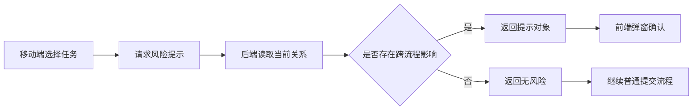

## 背景：一个抽象场景

在流程型系统里，很多操作看起来只是一次“绑定”或“确认”，但它背后可能会改变多个对象之间的关系。

例如，一个移动端现场操作页面允许用户选择业务单据、执行节点和处理位置，然后提交给后端生成后续任务。正常情况下，这只是一个标准提交；但当当前单据与其他单据存在资源复用、前后顺序或共享关系时，提交前就必须提醒用户：这次绑定可能会影响另一个流程的执行状态。

如果这类提示只写在前端页面里，就很容易失效：

- 前端只能看到当前页面已经加载的数据，不一定知道完整的跨流程关系。
- 共享关系可能在用户打开页面后发生变化。
- 不同端对“是否需要提醒”的判断条件可能不一致。
- 错误只在提交失败后出现，用户已经完成选择，操作体验会很割裂。

更稳的做法是：**后端提供权威风险提示，前端在关键操作前展示并要求确认，提交时后端仍做最终校验。**


## 问题拆解

这类“操作前提示”不是普通文案，而是一个轻量级契约。它至少要回答三个问题。

第一，当前操作是否存在风险。  
前端不应该根据一堆分散字段自行拼条件，而应该拿到一个明确的布尔值，例如 `hasRisk`。

第二，风险来自哪里。  
用户需要知道影响的是前序任务、后续任务，还是某一类共享资源。这里不需要暴露复杂内部模型，但需要给出足够的可理解上下文。

第三，涉及哪些关键对象。  
提示里可以展示脱敏后的对象名称、单据摘要或资源列表，让用户能确认自己是不是正在处理正确的对象。

一个抽象后的响应结构可以这样设计：

```java
public class OperationRiskTip {
    private Boolean hasRisk;
    private Long relatedTaskId;
    private String relatedTaskNo;
    private String relatedTaskName;
    private List<String> affectedResources;
}
```

这里的重点不是字段多少，而是**把判断权放在后端，把表达权交给前端**。

## 方案设计

### 后端：把提示接口设计成只读契约

提示接口最好保持只读，不在查询提示时修改状态。它的职责是根据当前数据库中的关系，判断本次操作是否需要额外确认。



这种设计有两个好处。

一是前端不需要复制复杂规则。规则越靠近数据，越容易保持一致。  
二是提示可以独立演进。后续如果风险来源从一种变成三种，前端只要按结构展示，不需要大改页面判断。

### 前端：提示不是装饰，而是提交门禁

移动端页面拿到提示后，不应该只显示一个轻飘飘的 toast。对于可能影响后续流程的操作，提示要成为提交前的门禁。

一个比较清晰的交互顺序是：

1. 用户选择业务单据和处理位置。
2. 前端请求后端提示接口。
3. 如果存在风险，弹出确认框并展示相关摘要。
4. 用户确认后才允许提交。
5. 提交失败时展示后端返回的明确错误，而不是统一显示“操作失败”。

抽象后的前端逻辑可以写成这样：

```js
async function confirmBeforeSubmit(form) {
  const tip = await api.getOperationRiskTip({
    taskId: form.taskId,
    nodeId: form.nodeId
  });

  if (tip?.hasRisk) {
    const ok = await showConfirm({
      title: "请确认关联任务",
      content: buildRiskMessage(tip)
    });
    if (!ok) return;
  }

  await api.submitBinding(form);
}
```

这里有一个容易被忽略的细节：**提示接口失败时如何处理**。

如果这个提示只是辅助信息，可以允许用户继续，但要在提交时依赖后端校验兜底；如果这个提示属于强约束，就应该阻断提交并提示稍后重试。选择哪种策略，取决于误操作的成本。

### 后端提交：提示不能替代校验

操作前提示改善的是用户决策，但不能替代后端校验。原因很简单：用户看到提示和真正提交之间存在时间差。

在这个时间差里，可能发生：

- 相关任务状态变化。
- 资源已经被其他流程占用。
- 共享关系被重新绑定。
- 用户在多个设备上重复提交。

所以提交接口仍然要重新读取关键状态，并做一次完整校验。

```java
@Transactional(rollbackFor = Exception.class)
public void submitOperation(OperationCommand command) {
    Task task = taskRepository.getById(command.getTaskId());
    if (task == null) {
        throw new BizException("任务不存在");
    }

    assertTaskCanBeHandled(task);
    assertNoConflictingSiblingTask(task.getId());
    refreshAllocationIfNeeded(task.getId());

    relationService.bindNextStep(command);
}
```

这段代码是脱敏后的写法，表达的是一个原则：**前端负责提前告知，后端负责最终裁决**。


## 常见坑

### 1. 把提示逻辑写死在前端

前端当然可以做一些体验层判断，比如当前是否已选择节点、是否存在必填项。但涉及跨单据、跨任务、跨资源的判断，最好不要让前端拼装规则。

一旦 Web 端、移动端、后端各自实现一套判断，就很容易出现“移动端认为可以提交，后端认为不可以；Web 端又显示另一种状态”的问题。

### 2. 只提示，不阻断

如果风险提示只是普通 toast，用户可能根本来不及读。对于会改变流程关系的操作，确认弹窗比 toast 更适合，因为它迫使用户停下来完成一次判断。

### 3. 错误反馈过于笼统

复杂流程里，“操作失败”几乎没有排查价值。后端应该尽量返回可行动的错误信息，例如：

- 当前任务已被其他节点处理。
- 关联任务状态已变化，请刷新后重试。
- 该资源已进入后续流程，不能重复绑定。
- 当前节点缺少必要的下一步选择。

前端则应该优先展示后端消息，而不是覆盖成固定文案。

### 4. 提示数据和提交数据没有同源

提示接口和提交接口应当使用同一套领域服务或校验方法。否则提示说“可以”，提交却失败，用户会觉得系统不可信。

## 可复用经验

这类场景可以沉淀成一套简单规则。

第一，凡是会影响其他任务的操作，都要考虑操作前提示。  
第二，提示接口只读，提交接口强校验。  
第三，前端只负责展示和交互，不复制核心判断。  
第四，提示内容要可理解，不要把内部字段原样甩给用户。  
第五，错误反馈优先使用后端返回的业务消息。  
第六，提示接口失败后的策略要明确，是允许继续，还是阻断提交。

## 总结

操作前风险提示看起来像一个小功能，但它本质上是复杂流程系统里的“决策辅助层”。

它把后端掌握的流程关系提前暴露给用户，让用户在真正提交前知道这次操作可能影响什么；同时又保留后端最终校验，避免提示和提交之间的状态变化造成数据错误。

对于多端协同、移动端现场操作、共享资源流转这类系统来说，这种模式很值得复用：**提示前置，规则后置；体验在前端，权威在后端。**

