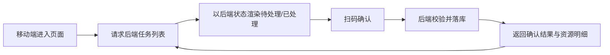
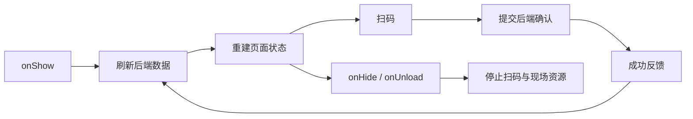

## 背景：一个抽象场景

在很多现场作业系统里，移动端并不是一个普通的表单入口，而是流程状态真正发生变化的地方。

操作人员会拿着移动设备扫描资源编码、确认处理结果、切换任务、进入下一步；Web 端负责配置、查看进度和处理异常；后端则承担状态流转、资源占用、校验和最终落库。

这类系统最容易出问题的地方，往往不是某个接口写错了，而是多个端对“当前状态”的理解不一致：

- 移动端本地缓存认为某个资源已经处理。
- 后端数据库认为这个资源仍处于待处理状态。
- Web 端聚合视图展示的是任务维度进度，但实际完成状态需要按更细粒度计算。
- 扫码时只匹配了资源类型，没有匹配具体资源唯一标识，导致重复资源或相同资源类型下的多站点任务被误处理。
- 一个资源被上一个流程占用，又被下一个流程提前拿来使用，形成跨流程串用。

这次优化可以抽象成一个问题：**在移动端高频扫码、后端多状态流转、Web 端聚合展示同时存在的系统里，如何保证状态来源唯一、操作可校验、反馈能闭环？**

## 问题拆解

### 1. 本地缓存不能成为最终状态来源

移动端为了体验，常常会缓存“已处理”的资源 ID。缓存本身没有问题，但如果把缓存当作权威状态，就会带来几个隐患：

- 页面返回后，缓存可能覆盖后端最新状态。
- 另一个端已经修改了状态，移动端仍显示旧结果。
- 任务切换后，缓存粒度不够细，可能串到相邻任务。
- 弱网或接口失败时，本地标记成功，但后端并未成功落库。

所以现场作业系统里，一个比较稳的原则是：**本地状态只用于短暂交互反馈，最终状态必须以后端返回为准。**

这次移动端逻辑的重点之一，就是在页面重新展示时主动刷新后端数据，并清理容易误导页面判断的本地已处理缓存。这样做看起来会多一次请求，但换来的是更清晰的状态边界。



### 2. 扫码匹配不能只看“看起来像”

在简单流程里，扫描到一个编码，只要资源类型匹配，就可以认为它是目标对象。但现场作业中经常会出现更复杂的情况：

- 同一种资源在多个位置都需要处理。
- 一个编码字符串里可能包含多个片段。
- 资源类型相同，但唯一标签不同。
- 某个资源已经处理过，再次扫码时需要明确提示“重复操作”。

如果移动端只用资源编码做宽松匹配，就会把“同类资源”误认为“同一个资源”。这类错误很隐蔽，因为页面上看起来像是扫对了，但实际处理的对象可能已经偏了。

更稳的匹配方式是分层：

1. 优先匹配唯一标签。
2. 没有唯一标签时，再尝试资源编码。
3. 如果同一编码存在多个待处理对象，必须要求扫描更精确的唯一标识。
4. 如果资源已经处理过，要给出重复操作提示，而不是静默忽略。

一个抽象后的移动端匹配逻辑可以写成这样：

```js
function findScanTarget(scanText, pendingItems, allItems) {
  const tokens = parseScanTokens(scanText);

  const byUniqueCode = pendingItems.find(item =>
    item.uniqueCode && tokens.has(String(item.uniqueCode))
  );
  if (byUniqueCode) {
    return { target: byUniqueCode };
  }

  const resourceCode = normalizeResourceCode(scanText);
  const sameCodePending = pendingItems.filter(item => item.resourceCode === resourceCode);

  if (sameCodePending.length === 1) {
    return { target: sameCodePending[0] };
  }

  if (sameCodePending.length > 1) {
    return { error: "存在多个待处理对象，请扫描唯一标签" };
  }

  const alreadyDone = allItems.find(item =>
    item.done && item.resourceCode === resourceCode
  );
  if (alreadyDone) {
    return { error: "该对象已处理，请勿重复扫描", type: "repeat" };
  }

  return { error: "扫描对象与当前任务不匹配" };
}
```

这段逻辑的核心不是代码本身，而是它把扫码结果拆成了几个有优先级的判断：唯一标识优先、模糊匹配兜底、歧义时拒绝、重复时提示。

## 方案设计

### 后端：把校验收敛到权威状态

后端需要承担几个职责：

- 判断当前流程是否允许继续执行。
- 判断资源是否仍在可操作位置。
- 判断资源是否属于当前任务或可复用关系。
- 判断资源是否被上一流程占用。
- 判断状态流转后是否需要同步更新其他任务进度。

如果这些判断散落在前端，很容易因为页面入口不同而出现漏校验。更专业的做法是把它们收敛到后端服务层，让前端只负责展示和交互。

一个抽象后的校验顺序可以这样组织：

```java
public OperationResult confirmOperation(ConfirmRequest request) {
    Task task = taskRepository.getRequired(request.getTaskId());
    Resource resource = resourceRepository.getByUniqueCode(request.getUniqueCode());

    assertTaskExecutable(task);
    assertResourceExists(resource);
    assertResourceBelongsToTaskOrSharedGroup(task, resource);
    assertResourceNotOccupiedByPreviousFlow(task, resource);
    assertOperationNotRepeated(task, resource);

    OperationRecord record = operationService.markDone(task, resource);
    progressService.refreshTaskProgress(task.getId());

    return OperationResult.from(record, resource);
}
```

这里有一个重要原则：**前端可以提前拦截明显错误，但不能替代后端校验。**

前端的拦截是为了减少误操作和改善体验；后端校验则是为了保护数据一致性。尤其在移动端场景里，设备可能离线、网络可能抖动、用户可能返回页面重扫，只有后端状态才是最终可信来源。

### 移动端：用后端结果刷新页面，而不是相信旧页面

移动端优化的关键是“每次回到页面都重新理解现场”。

常见写法是页面加载时请求一次数据，然后本地维护列表状态。但如果用户从详情页返回、设备从后台恢复、或者另一个端已经完成了操作，页面就可能变成旧状态。

更稳的策略是：

- 页面展示时重新拉取任务数据。
- 操作成功后使用后端返回的结果刷新列表。
- 只把本地状态作为正在处理、等待反馈、动画提示等临时状态。
- 页面隐藏或退出时释放扫码、亮灯、订阅等现场资源。



这个思路可以避免很多“页面看着完成了，实际没完成”的问题。

### Web：聚合展示要回到真实进度

Web 端经常需要把多个子任务聚合成一个主任务行。如果只是把子任务行简单相加，某些状态会看起来正确，但细节可能不准确。

比如按任务维度展示时，每个子任务有自己的进度；按单据维度展示时，最终进度应该重新基于真实资源状态计算，而不是直接复用某个子任务的字段。

所以聚合视图需要注意两点：

- 聚合后重新同步进度字段。
- 展示字段和可操作字段分开，不要让聚合行携带错误的单个子任务 ID。

这类细节对用户体验影响很大。现场系统里，操作人员和管理人员通常都是根据进度数字判断下一步动作，如果数字滞后或错误，就会引导出错误操作。

## 资源复用场景下的边界判断

这次提交里还有一个很典型的复杂点：资源可能在相邻流程之间复用。

资源复用本身是合理的，但它会打破简单系统里的假设。原来一个资源只属于一个任务，现在它可能属于一个共享组；原来处理完成后资源就进入回收流程，现在它可能要直接交给下一流程继续使用。

这会带来三个边界问题：

1. **复用关系如何匹配。**  
   不能只按资源类型匹配，还要结合位置、任务节点或共享组关系，避免同类资源串用。

2. **资源是否已经被上一流程占用。**  
   如果资源还在上一流程的临时位置或执行节点上，下一流程不能直接把它当成可用资源。

3. **复用时是否需要自动补建分配记录。**  
   某些情况下，资源已经满足下一流程使用条件，但数据库中还没有当前流程的分配记录。此时可以由后端在严格校验后补建关系，而不是让前端绕过状态。

抽象成数据模型，大概是这样：

```text
Resource
  - id
  - uniqueCode
  - currentLocation
  - currentFlowId

TaskItem
  - id
  - taskId
  - resourceType
  - positionKey
  - shareGroupId
  - status

Allocation
  - taskItemId
  - resourceId
  - allocationOrder
```

在这个模型里，`shareGroupId` 只能说明“存在复用关系”，不能直接说明“任何同类资源都能用”。真正匹配时还需要结合 `resourceType + positionKey + currentLocation + currentFlowId` 这类约束。

## 关键实现示例

### 以后端状态覆盖本地状态

移动端最容易犯的错误，是把本地缓存和后端状态做或运算：

```js
item.done = Boolean(serverItem.done || localDoneIds.has(serverItem.id));
```

这看起来能提升体验，但一旦本地缓存过期，就会把后端真实状态盖掉。

更可靠的写法是：

```js
clearLocalDoneCache(taskId);

items = serverItems.map(item => ({
  id: item.id,
  uniqueCode: item.uniqueCode,
  resourceCode: item.resourceCode,
  status: item.status,
  done: Boolean(item.done)
}));
```

本地缓存不是不能用，而是要限制用途。它可以保存扫描框输入、当前选中项、临时动画状态，但不应该决定业务对象是否已经完成。

### 给响应补足可刷新页面的明细

如果确认接口只返回“成功/失败”，前端就只能猜下一步怎么更新页面。更好的接口响应应该包含足够的资源明细，让前端可以准确提示和刷新。

```java
public class ConfirmOperationResp {
    private Long taskItemId;
    private Long resourceId;
    private Long resourceLabelId;
    private String uniqueCode;
    private String resourceCode;
    private String resourceName;
    private String sourceLocationName;
    private String targetLocationName;
}
```

这类字段不一定都要展示，但它们能让前端在成功提示、列表刷新、重复扫码判断时少走很多弯路。

## 常见坑

### 坑一：页面返回时不刷新

移动端页面栈很容易让人以为 `onLoad` 足够，但现场操作里，用户经常从 A 页面跳到 B 页面再返回。只在首次加载时取数据，会导致返回后看到旧状态。

更稳的是在页面重新显示时刷新关键列表，同时避免重复注册扫码监听、消息订阅或定时器。

### 坑二：重复扫码只做静默忽略

重复扫码如果没有明确提示，用户会以为设备没有扫到，于是继续扫，最终让问题更难排查。重复操作应该是一种明确状态，而不是普通失败。

### 坑三：共享资源只按类型匹配

共享资源场景下，类型相同不代表对象相同。尤其当同一资源类型出现在多个位置或多个任务节点时，必须增加唯一标签、位置、共享组、当前占用流程等约束。

### 坑四：聚合行直接复用子任务状态

Web 端聚合展示时，如果直接拿第一条子任务的状态或 ID，容易让页面展示和实际操作语义不一致。聚合行应该重新计算进度，必要时去掉单个子任务语义。

## 可复用经验

这次优化可以沉淀成一组适用于现场作业系统的设计规则：

- **后端是业务状态的唯一权威来源。**  
  移动端可以缓存交互状态，但不要用缓存覆盖业务完成状态。

- **扫码匹配要先唯一、再模糊、歧义拒绝。**  
  唯一标签优先；同类多对象时必须要求更精确的标识。

- **确认接口要返回可刷新页面的明细。**  
  不要只返回成功，应该让前端能基于响应更新提示、列表和下一步动作。

- **跨流程复用必须校验占用边界。**  
  资源能复用，不代表任意时刻都能被下一流程使用。

- **聚合展示要重新计算真实进度。**  
  Web 端展示层可以聚合，但聚合后的状态不能丢失业务语义。

- **页面生命周期要负责释放现场资源。**  
  扫码监听、灯控、消息订阅、音频反馈等，都要在隐藏或退出时收敛。

## 总结

移动端现场作业系统的难点，不是把一个扫码按钮做出来，而是让扫码之后的状态在移动端、Web 端和后端之间保持一致。

一个成熟的设计通常会把职责拆清楚：移动端负责快速反馈和现场交互，Web 端负责聚合展示和管理，后端负责权威校验和状态流转。只要这个边界清晰，很多看似偶发的问题，比如重复扫码、页面旧状态、资源串用、进度不准，都会变成可以系统性处理的工程问题。

这也是复杂业务系统里很值得复用的一条经验：**越靠近现场的操作，越需要把最终判断放回后端；越高频的交互，越需要清晰的状态边界。**

