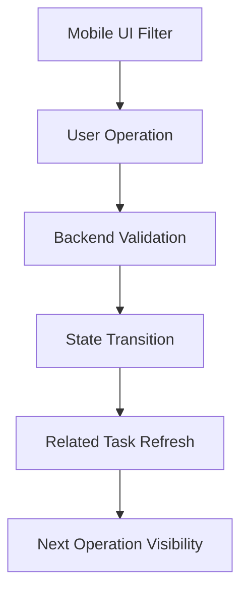

在移动端和后台服务共同参与的系统里，一个任务往往不会只有“开始”和“完成”两个状态。它可能经历准备、绑定、执行、交接、释放、结束等多个阶段。每个阶段都可能由不同入口触发：有些操作在 Web 端发起，有些操作在移动端完成，最终状态又必须由后端统一确认。

如果状态边界设计得不清楚，系统很容易出现两类问题：一类是用户明明可以继续操作，却被页面过早拦住；另一类是用户能点按钮，但后端状态其实已经不允许这个动作继续执行。


这篇文章用一个抽象案例，聊聊多阶段任务流里如何同时处理“放宽入口”和“收紧校验”。

## 背景：一个多端协同的任务流

假设有一个现场作业系统，任务会在多个阶段之间流转：

- `WAITING`：等待开始
- `PREPARING`：准备中
- `READY`：可绑定资源
- `RUNNING`：执行中
- `HANDOVER`：交接中
- `DONE`：已完成

移动端需要支持现场人员选择任务、绑定设备、提交交接结果；后端需要判断当前任务是否允许进入下一阶段；管理端则负责展示任务明细和异常提示。

看起来只是“多允许几个状态”，但实际上这会牵出一整套状态判断策略。

## 问题拆解

这次改造可以抽象成三个核心问题。

第一，移动端入口太窄。  
如果移动端只允许 `WAITING` 状态进入操作页面，那么已经处在准备中或待绑定阶段的任务就无法继续现场处理。用户需要绕回其他页面或等待后台状态修正，体验很差。

第二，设备选择太宽。  
如果页面只排除一部分不可用设备，而不是明确只允许 `IDLE` 状态设备，就可能把执行中、待释放、异常中的设备也展示出来。现场用户一旦重复绑定，就会把后端状态推向更复杂的冲突分支。

第三，结束动作缺少前置确认。  
任务结束前，如果同一批次、同一组关联任务还没有准备好，直接执行结束或释放动作，会导致后续任务拿不到完整上下文。这个问题不能只靠操作员记忆，系统应该在提交前给出提示，并在后端再次校验。

## 方案设计

这类多阶段任务流可以拆成三层校验：



移动端负责过滤明显不可选项，后端负责最终一致性，状态推进后再反向刷新相关任务的可见状态。

## 移动端：放宽任务入口，收紧资源选择

移动端常见的误区是：任务状态允许范围和资源状态允许范围混在一起判断。

任务入口可以适当放宽，因为用户需要在多个中间态继续操作：

```ts
const bindableTaskStatuses = [
  TaskStatus.WAITING,
  TaskStatus.PREPARING,
  TaskStatus.READY
]

function canEnterBindPage(task: TaskRow) {
  return bindableTaskStatuses.includes(task.status)
}
```

但资源选择应该更严格。与其排除几个“不可选状态”，不如只允许一个明确的安全状态：

```ts
function getAvailableDevices(devices: DeviceRow[]) {
  return devices.filter(device => device.status === 'IDLE')
}
```

这两段判断背后的原则不同：

- 任务入口判断解决的是“用户能不能继续流程”。
- 资源选择判断解决的是“这个动作会不会造成重复占用”。

一个放宽，一个收紧，不能写成同一套模糊规则。

## 后端：状态推进必须基于事实，而不是页面传参

移动端可以提前过滤，但后端不能相信前端状态一定最新。尤其在现场操作系统里，弱网、重复点击、多人并发操作都很常见。

后端更适合用“事实计数”推动状态，而不是只看请求里带来的目标状态。

例如，当任务需要等待所有子项进入执行状态后，才能把主任务推进到下一阶段：

```java
public void refreshTaskRunningState(Long taskId) {
    TaskSnapshot snapshot = taskRepository.loadSnapshot(taskId);

    int requiredDeviceCount = devicePlanRepository.countRequiredDevices(snapshot.getPlanId());
    int runningDeviceCount = deviceTaskRepository.countRunningDevices(taskId);

    if (runningDeviceCount >= requiredDeviceCount) {
        taskRepository.updateStatus(taskId, TaskStatus.RUNNING);
    }
}
```

这里的关键点是：状态推进不是由按钮决定的，而是由后端根据当前事实重新计算。

这种方式有几个好处：

- 前端刷新慢也不会影响最终状态。
- 重复提交只会重复计算，不会重复推进。
- 后续规则变化时，只需要调整后端状态判断。

## 结束前校验：把“隐性依赖”变成明确提示

很多复杂流程的坑，来自“当前任务结束会影响关联任务”。用户在移动端看到的是一个结束按钮，但系统内部可能还要检查同批次任务、共享资源、待交接项、未创建的后续任务等条件。

比较好的做法是做两层检查。

第一层是提交前提示：

```ts
async function beforeFinishTask(taskId: number) {
  const result = await api.checkRelatedTasks(taskId)

  if (result.hasMissingTasks) {
    await showConfirm({
      title: '存在未准备完成的关联任务',
      content: '继续结束可能影响后续流程，是否确认继续？'
    })
  }

  return finishTask(taskId)
}
```

第二层是后端强校验：

```java
public void finishTask(Long taskId) {
    RelatedTaskCheckResult check = relatedTaskService.checkBeforeFinish(taskId);

    if (check.hasBlockingItems()) {
        throw new BizException("related tasks are not ready");
    }

    taskFlowService.finish(taskId);
    sharedResourceService.transferAfterFinish(taskId);
}
```

前端提示是为了减少误操作，后端校验是为了保证数据不会被错误推进。


## 交接逻辑：按组处理比按单条处理更稳

多阶段任务流里，交接往往不是单条记录的状态变化，而是一组相关记录共同完成。

如果按单条记录逐个判断，很容易出现这种情况：

- A 记录已经交接
- B 记录还未交接
- C 记录属于共享资源，需要等另一个任务处理
- 页面显示整体完成，但后端还有未处理项

更稳的方式是先聚合，再判断：

```java
public HandoverResult completeHandover(Long groupId) {
    List<HandoverItem> items = handoverRepository.findByGroupId(groupId);

    long unfinishedCount = items.stream()
        .filter(item -> !item.isFinished())
        .count();

    if (unfinishedCount > 0) {
        return HandoverResult.partial(unfinishedCount);
    }

    handoverRepository.markGroupFinished(groupId);
    resourceService.releaseOrTransfer(groupId);
    return HandoverResult.completed();
}
```

这里的重点不是代码写法，而是建模方式：把“交接完成”定义在组维度，而不是让每一条明细自己决定整体状态。

## 共享资源流转：清空字段时要显式更新

当任务结束后，如果某个共享资源要流向下一个任务，后端通常会做类似处理：

- 当前任务标记为已处理
- 下一个任务提升为当前任务
- 清空 `nextTaskId`
- 如果没有下一个任务，则清空当前任务引用
- 如果整组都已完成，则把组状态置为完成

这里有个很容易被忽略的技术细节：如果使用 MyBatis-Plus，想把字段清空为 `NULL`，不能只依赖实体对象的 `setXxx(null)`。

更可靠的写法是使用 `LambdaUpdateWrapper` 显式设置：

```java
shareGroupMapper.update(
    null,
    new LambdaUpdateWrapper<ShareGroupEntity>()
        .eq(ShareGroupEntity::getId, groupId)
        .set(ShareGroupEntity::getCurrentTaskId, nextTaskId)
        .set(ShareGroupEntity::getNextTaskId, null)
);
```

原因是 MyBatis-Plus 默认会忽略实体里的 `null` 字段。涉及状态流转时，如果该清空的字段没有真正清空，后续判断就会读到旧值，形成隐藏状态污染。

## 容易踩坑的点

### 1. 用排除法判断设备可选

排除法很容易漏状态。设备类资源建议使用白名单判断，只允许明确安全的 `IDLE` 状态进入绑定流程。

### 2. 前端放宽入口后，后端没有同步规则

移动端允许更多任务状态进入页面后，后端接口也要能识别这些中间态，否则用户会在页面上能操作，但提交时失败。

### 3. 状态推进只看当前请求

复杂流程里，状态推进应该基于数据库事实重新计算，而不是直接相信前端传来的目标状态。

### 4. 结束动作缺少关联检查

结束一个任务可能影响后续任务、共享资源和交接记录。结束前检查应该独立成服务能力，而不是散落在页面按钮逻辑里。

### 5. 清空字段没有显式 set null

状态流转经常需要清空当前指针、下一指针或临时标记。使用 MyBatis-Plus 时，要用 `Wrapper.set(field, null)` 明确生成 `SET field = NULL`。

## 可复用经验

遇到多阶段任务流，可以按下面的顺序设计：

1. 先列出所有状态和状态之间允许的动作。
2. 把“页面可进入状态”和“资源可绑定状态”拆开。
3. 前端做体验层过滤，后端做权威校验。
4. 状态推进基于事实计数或聚合结果，不基于按钮意图。
5. 对关联任务、共享资源、交接组做统一服务封装。
6. 对字段清空、重复提交、弱网重试做专门处理。


## 总结

多阶段任务流的复杂度不在于状态数量，而在于每个状态背后的责任边界。

移动端要让用户能顺畅地继续现场流程，但不能把不安全资源暴露出来；后端要允许合理的中间态操作，但必须在真正推进状态前重新校验事实；交接和共享资源流转要按组建模，避免单条记录各自为政。

当一个流程开始同时影响移动端入口、后端状态、资源流转和交接结果时，它就不再是“改几个条件判断”的问题，而应该被当成一套状态机和一致性规则来设计。

