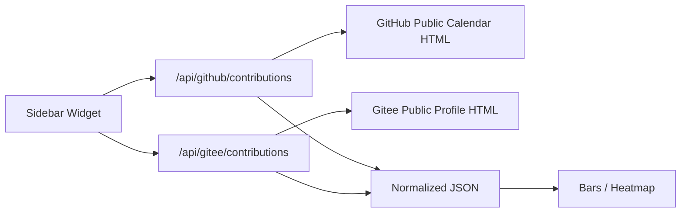

很多个人技术博客都会放一些“活跃度”信息：最近写了多少文章、今天提交了多少代码、最近有没有持续维护项目。最直接的想法是把 GitHub 贡献图搬到侧边栏，但实际做起来会发现：如果日常提交分散在多个平台，单独展示 GitHub 并不能反映真实节奏。

这次我做的是一个博客侧边栏小组件：同时展示 GitHub 与 Gitee 的每日贡献数据。GitHub 使用最近 14 天柱状图，Gitee 使用最近 50 天小方块热力图；文字上，Gitee 还展示“近 1 年贡献总数”。组件不依赖私有 token，只读取两个平台公开个人主页上已经可见的贡献汇总。


这篇文章不展开具体博客样式，而是抽象聊聊这个小功能背后的几个工程点。

## 背景：公开数据可以看见，不代表可以直接使用

需求本身很简单：

- 首页侧边栏展示每日提交数量。
- GitHub 和 Gitee 都要展示。
- Gitee 的贡献图支持小方块热力图。
- 鼠标悬停在方块上时，能看到当天贡献次数。
- 卡片要足够紧凑，不能因为图表把底部文字挤出容器。

真正的问题在于：两个平台都能在页面上看到贡献图，但它们的数据结构完全不同。

GitHub 贡献图的公开片段接近这种结构：

```html
<td data-date="2026-06-05" id="contribution-day-component-..."></td>
<tool-tip for="contribution-day-component-...">
  2 contributions on June 5th.
</tool-tip>
```

日期在 `td` 上，贡献次数在对应的 `tool-tip` 文本里。

Gitee 贡献图则更像这样：

```html
<div
  class="box little"
  date="20260605"
  data-content="3个贡献：2026-06-05">
</div>
```

日期是 `YYYYMMDD`，次数藏在中文 `data-content` 文本里。如果解析器只按 `data-date` / `data-count` 去抓，结果就会全部是 0。

所以这个功能的第一步不是画图，而是先把“可见页面”变成稳定的数据接口。

## 方案：后端代理解析，前端只消费统一 JSON

浏览器端直接抓第三方页面会遇到跨域、缓存、隐私和可维护性问题。更合理的结构是：用服务端函数做一个轻量代理，把平台页面解析成统一结构。



统一后的数据结构可以保持很小：

```json
{
  "ok": true,
  "user": "demo-user",
  "totalLabel": "近 1 年",
  "total": 2397,
  "today": { "date": "2026-06-05", "count": 3 },
  "days": [
    { "date": "2026-06-04", "count": 4 },
    { "date": "2026-06-05", "count": 3 }
  ]
}
```

前端不关心 GitHub 的 tooltip 怎么写，也不关心 Gitee 的 `date="20260605"` 怎么转换；它只关心 `days`、`today` 和 `total`。

## 数据归一化：用时间线兜住平台差异

贡献数据有一个容易忽略的细节：不能只返回“有贡献的日期”。否则前端画图时会丢失空白日期，热力图的节奏也会变形。

更稳的做法是先生成固定长度的时间线，再把平台解析到的计数填进去：

```js
function normalizeTimeline(days, length) {
  const counts = new Map(days.map((day) => [day.date, day.count]));

  return createEmptyTimeline(length).map((day) => ({
    ...day,
    count: counts.get(day.date) || 0,
  }));
}
```

这样不管平台返回 14 天、50 天还是 365 天，前端拿到的都是连续日期：

- GitHub：请求最近 14 天，画柱状图。
- Gitee：请求最近 365 天，用于年度统计。
- Gitee 热力图：只截取最后 50 天展示。

这里还做了一个拆分：**统计范围和可视范围不必相同**。

文字展示“近 1 年 2397 次”，这是统计信息；方块展示最近 50 天，这是视觉信息。两个范围分开后，小组件既能保留年度总量，又不会因为 365 个点把侧边栏撑爆。

## Gitee 解析：优先使用页面上的年度汇总

Gitee 页面本身已经提供“最近一年贡献：xxxx 次”。如果直接把 365 个格子的数字相加，理论上也能得到结果，但会带来两个问题：

第一，页面结构变化时，格子解析可能失效。  
第二，年度总数是平台自己展示的权威汇总，优先使用它更符合用户看到的结果。

因此 Gitee 接口可以同时解析两类信息：

```js
function getYearTotal(html) {
  const match =
    html.match(/Contributions last year:\s*(\d+)/i)
    || html.match(/最近一年贡献[：:]\s*(\d+)/);

  return match ? Number(match[1]) : null;
}
```

格子数据用于热力图，年度汇总用于文案。这样即使视觉图只展示 50 天，文字也可以准确表达最近一年贡献总数。

## 前端展示：柱状图和热力图共用一个数据模型

组件里每个平台只有一份配置：

```js
const platforms = [
  {
    id: "github",
    name: "GitHub",
    endpoint: "/api/github/contributions?days=14",
    chart: "bars",
    rangeLabel: "14 天前",
  },
  {
    id: "gitee",
    name: "Gitee",
    endpoint: "/api/gitee/contributions?days=365",
    chart: "heatmap",
    rangeLabel: "50 天前",
    visibleDays: 50,
  },
];
```

渲染时先根据 `chart` 决定图形类型：

```js
if (row.dataset.chart === "heatmap") {
  const chartDays = days.slice(-visibleDays);
  renderHeatmap(container, chartDays);
} else {
  renderBars(container, days);
}
```

这能避免把 GitHub 和 Gitee 写成两套完全独立的组件。平台差异放在配置和接口里，视觉渲染则复用同一套状态更新逻辑。

## 小方块图：交互比图形本身更重要

热力图最关键的不是“有一堆绿色方块”，而是用户能知道每个方块代表哪一天、多少次。

浏览器原生 `title` 可以用，但体验比较慢，也不够稳定。更好的方式是给每个方块写入 `data-tooltip`，用 CSS 伪元素做自定义浮层：

```css
daily-commit-widget .daily-commit-cell:hover::after,
daily-commit-widget .daily-commit-cell:focus::after {
  content: attr(data-tooltip);
  position: absolute;
  bottom: calc(100% + 0.45rem);
  left: 50%;
  transform: translateX(-50%);
  padding: 0.35rem 0.5rem;
  border-radius: 0.45rem;
  background: rgb(38 38 38);
  color: white;
  white-space: nowrap;
}
```

同时给方块加上键盘可聚焦能力：

```js
cell.dataset.tooltip = `${day.date} · ${count} 次贡献`;
cell.setAttribute("aria-label", cell.dataset.tooltip);
cell.tabIndex = 0;
```

这样鼠标用户可以 hover，键盘用户也可以 focus。一个小组件不一定要做得复杂，但基本可访问性不应该被忽略。


## 一个很典型的坑：Astro scoped style 与动态 DOM

这次最容易误判的问题，是“数据已经到了，但图是空的”。

接口返回正常，摘要也能显示：

```text
近 1 年 2397 次
```

但热力图方块区域是空白。原因不是数据，也不是颜色，而是 Astro 的样式作用域。

Astro 组件里的普通 `<style>` 默认会被 scoped。静态模板中的元素会自动带上作用域属性，但运行时通过 `document.createElement()` 动态创建的元素不会带这个属性。结果就是：

- DOM 里确实有 `.daily-commit-cell`
- CSS 选择器实际匹配不上
- 方块没有宽高和背景，看起来像没渲染

解决方式是把这段组件样式改成全局作用域，同时仍然用宿主标签限制范围：

```astro
<style is:global>
  daily-commit-widget .daily-commit-cell {
    width: 0.62rem;
    height: 0.62rem;
    border-radius: 0.16rem;
  }
</style>
```

这不是随便把样式全局化，而是做了一个局部命名空间：所有规则都挂在 `daily-commit-widget` 下。动态 DOM 能吃到样式，也不会污染博客其他区域。

## 布局调试：信息密度要服务于侧边栏

侧边栏空间很窄，热力图如果使用 `space-between` 把列拉满，会出现两个问题：

- 方块之间距离太大，看起来松散。
- 图表高度和底部文字互相挤压，最后一行说明可能被挡住。

更适合侧边栏的方式是固定小方块尺寸、固定列间距、整体居中：

```css
daily-commit-widget .daily-commit-heatmap {
  display: grid;
  grid-auto-flow: column;
  grid-template-rows: repeat(7, minmax(0, 0.62rem));
  grid-auto-columns: minmax(0, 0.62rem);
  gap: 0.22rem 0.42rem;
  justify-content: center;
  min-height: 5.2rem;
}
```

这里有一个取舍：一开始展示 30 天，图显得有点空；展示 60 天又偏多。最后选择 50 天，能保留近期趋势，又不会挤压卡片。

## 可复用经验

这类小组件看上去是 UI 细节，但背后有几条可复用原则。

第一，第三方公开页面要先抽象成自己的数据模型。  
不要让前端直接理解平台 HTML。平台结构差异应该被后端代理接口消化掉。

第二，统计范围和视觉范围可以拆开。  
年度总数用于文案，最近 50 天用于热力图。信息更完整，视觉也更克制。

第三，动态 DOM 要特别注意样式作用域。  
在 Astro、Vue scoped CSS、CSS Modules 等体系里，只要元素是运行时创建的，就要确认它是否能匹配到样式。

第四，小尺寸图表要优先考虑可读性。  
方块数量、间距、tooltip、底部标签，都比“把所有数据塞进去”更重要。

第五，外部抓取接口要有兜底。  
公开页面可能超时、结构可能变化、第三方 API 可能失败。接口可以返回空时间线或缓存结果，但不应该轻易把整个页面渲染链路拖垮。

## 总结

一个“每日提交”侧边栏小组件，最终涉及了数据抓取、HTML 解析、时间线归一化、跨平台配置、动态 DOM、CSS 作用域和可视化交互。

它的核心不是把 GitHub 或 Gitee 的页面原样搬过来，而是把不同平台的公开贡献信息抽象成统一时间线，再根据侧边栏空间选择合适的表达方式。

类似的思路也可以用在很多个人站点或内部看板里：先把第三方数据收敛成稳定接口，再用小而清晰的组件表达趋势。功能越小，越适合把边界做干净。

