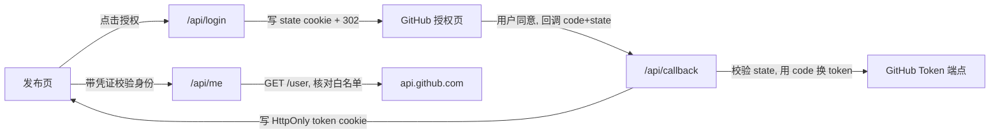
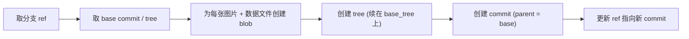

我的博客是一个纯静态站点（Astro/Fuwari 构建，托管在边缘平台上）。它的"发布"本质就是一次 `git push`：写好 Markdown，本地构建，提交，平台自动重新部署。

但我想要的不止是写长文。我还想有一个"朋友圈"式的页面：随手发一条图文动态，配几张图，点一下就上线，不用打开本地工具链。问题是——**静态站没有后端，没有数据库，没有会话**。怎么在这种约束下做一个需要登录、需要写数据的发布后台？

这篇文章记录整个系统从零搭起来的思路，重点放在两件事上：一是单点登录怎么做（GitHub OAuth），二是一个**让我反复提交了十几次都没解决的坑**——它把我引向了完全错误的方向，最后却是一行请求头的事。


## 背景：把"发布"重新定义成"一次提交"

先把约束摆清楚：

- 站点是静态的，没有常驻服务端。
- 没有数据库，动态数据只能落在仓库文件里。
- 但平台支持「边缘函数」（Functions 目录约定，`/api/*` 走 Serverless）。

关键的一步是换个角度看"发布"。既然站点重新部署是由 `git push` 触发的，那么"发一条图文动态"完全可以等价于：

> 往仓库里写一个数据文件（追加一条记录）+ 几张图片 → 触发自动部署。

这样一来，静态站也能拥有"动态发布"能力，而真正要解决的问题被拆成了三个：

1. **鉴权**：怎么在浏览器里，安全地以仓库所有者的身份，拿到一个能写仓库的凭证？
2. **写入**：在没有本地 Git 的边缘函数里，怎么把"一条数据 + 多张图片"一次性原子地提交进仓库？
3. **运行**：静态站怎么凭空有"接口"？

第三个问题靠平台的边缘函数解决；前两个才是工程重点。其中鉴权是核心，也是最容易翻车的地方。

## 问题拆解：鉴权这条路有几种走法

最省事的做法是让用户自己生成一个 Personal Access Token 贴进输入框。但这体验差、也容易把 token 暴露在不该出现的地方。更体面的做法是 **OAuth 单点登录**：用户点一下"用 GitHub 登录"，跳到 GitHub 授权页，确认后跳回来，系统就拿到了一个代表该用户、且权限被限定的访问令牌。

于是鉴权被进一步拆成：

- 发起授权（带上防 CSRF 的 `state`）。
- 回调里用 `code` 换 `access_token`，并把登录态存住。
- 每次操作前校验令牌，并核对登录名是否在白名单内（只允许仓库所有者发布）。

## 方案设计

### 单点登录：GitHub OAuth Web Flow

整个 Web Flow 可以全部落在边缘函数里，前端只负责跳转和读结果。



几个关键点：

- **`state` 防 CSRF**：发起授权时生成一个随机 `state`，写进 `HttpOnly` cookie；回调时比对，不一致直接拒绝。
- **登录态用 `HttpOnly` + `Secure` + `SameSite=Lax` 的 cookie 存**：顶层跳转回来时浏览器会带上它，后续同源请求自动携带。
- **最小权限**：OAuth scope 只申请 `public_repo`，够提交公开仓库即可。
- **白名单**：`/api/me` 不只是校验 token 有效，还要核对 `login` 是不是仓库所有者，避免别人登录后也能发。

发起授权的函数大致是这样（已抽象）：

```js
const authorizeUrl = new URL("https://github.com/login/oauth/authorize");
authorizeUrl.searchParams.set("client_id", env.OAUTH_CLIENT_ID);
authorizeUrl.searchParams.set("redirect_uri", redirectUri);
authorizeUrl.searchParams.set("scope", "public_repo");
authorizeUrl.searchParams.set("state", state); // 同时写进 HttpOnly cookie

return new Response(null, {
  status: 302,
  headers: {
    Location: authorizeUrl.toString(),
    "Set-Cookie": cookie("oauth_state", state, { httpOnly: true, maxAge: 600 }),
  },
});
```

### 写入：用 Git Data API 做一次"无工作区的提交"

边缘函数里没有 `git` 命令，但 GitHub 提供了底层的 **Git Data API**，可以纯靠 HTTP 拼出一次提交。流程是固定的几步：



这本质上是手工搭一棵 Git 对象树：图片以 base64 作为 blob 写入，数据文件（追加了新记录的 JSON）也作为 blob 写入，然后挂到一棵新的 tree 上，生成 commit，最后把分支指过去。好处是**多文件原子提交**——图片和数据要么一起进，要么都不进；提交完成，平台自动重新部署，几分钟后动态就上线了。

```js
// 省略错误处理：取 ref → 取 base commit → 建 blob → 建 tree → 建 commit → 更新 ref
const blobSha = await createBlob(apiBase, token, base64Image); // encoding: "base64"
const tree = await createTree(apiBase, token, {
  base_tree: baseCommit.tree.sha,
  tree: [
    { path: "public/images/moments/xxx.jpg", mode: "100644", type: "blob", sha: blobSha },
    { path: "src/data/moments.json", mode: "100644", type: "blob", sha: dataBlobSha },
  ],
});
const commit = await createCommit(apiBase, token, {
  message: "chore: publish a moment",
  tree: tree.sha,
  parents: [baseCommitSha],
});
await updateRef(apiBase, token, branch, commit.sha);
```

到这里，方案在纸面上已经闭环了。然后我就掉进了坑里。


## 那个困了我十几次提交的坑：边缘函数调 GitHub API 必须带 User-Agent

### 现象：登录"成功"了，却存不住

OAuth 跳转一切顺利：点授权、跳到 GitHub、点同意、跳回发布页，页面明明提示"**已返回授权**"——然后下一句却是"**登录状态没有保存成功，请重新授权**"。无论刷新多少次，都卡在这。

我换了条路：手动生成一个 token 贴进输入框试试。结果更诡异——**同一个 token，我在本地用 `curl` 测能正常拿到用户信息，贴进系统却说"token 无效"**。

### 走过的所有弯路

如果去翻这个功能的提交记录，会看到一段非常"挣扎"的历史，全在围着登录态打转：

```text
fix: preserve github oauth token cookie
fix: make github oauth cookie persist reliably
fix: pass github oauth token from callback
fix: bypass swup for github oauth login
fix: store oauth token before returning to publish page
fix: validate manual github token directly
fix: sanitize manual github token input
feat: publish portfolio with server token key
... （十几个 commit）
```

能看出当时的所有猜测：

- 怀疑 **cookie 没存住** → 反复调 `SameSite`、`Secure`、各种"persist/preserve cookie"。
- 怀疑 **SPA 路由（swup）把跳转拦了** → 给登录链接加 `data-no-swup` 绕过。
- 怀疑 **token 没从回调传回前端** → 又加了一份 `sessionStorage` 传递。
- 怀疑 **手动 token 格式不对** → 加清洗、加前缀校验。
- 最后甚至**整个推翻**，改成"服务端密钥"方案。

十几次提交，没有一次说到点子上。因为方向从一开始就错了。

### 真正的原因

**GitHub 的 REST API 强制要求每个请求带 `User-Agent` 头，否则直接返回 403。** 它的报错其实写得明明白白：

```text
Request forbidden by administrative rules.
Please make sure your request has a User-Agent header
```

而问题在于：**浏览器和 `curl` 都会自动加 `User-Agent`，但边缘 / Serverless 运行时的 `fetch` 不会自动加。** 我的登录校验函数在调 `api.github.com/user` 时没带这个头 → GitHub 回 403 → 代码把"请求失败"理解成了"token 无效" → 前端显示"登录没保存住"。

一行请求头，全部症状。

### 为什么它这么难定位

这个坑之所以能耗掉十几次提交，是因为它布了三层烟雾弹：

1. **OAuth 换 token 那一步是好的。** 用 `code` 换 `access_token` 走的是 `github.com/login/oauth/access_token`，这个端点**不**强制 `User-Agent`，所以"登录看起来成功了"。这把所有注意力都引向了"登录态 / cookie 没存住"这条死胡同——可那条路根本没坏。
2. **本地 `curl` 测 token 是好的。** 因为 `curl` 自动带了 UA。于是"token 没问题"这个**错误结论**让人坚信问题在别处。"本地能用、部署上去就不行"——这其实是最大的线索，当时却被当成了灵异事件。
3. **同项目里另一个功能恰好是好的。** 侧边栏有个抓取贡献热力图的函数，它当初**碰巧**写了 `User-Agent`，一直正常。于是"这个项目调 GitHub API 没问题"的假象成立，进一步排除了正确方向。

### 定位方法：别盲改，去拿"地面真相"

跳出来之后，定位其实很快。核心是**别再改你"以为有问题"的代码，去对照一个能用的客户端**：

- 直接探活线上端点，确认 OAuth 跳转、`state` cookie 都是对的（排除"登录态"嫌疑）。
- 对 `api.github.com` 做对照实验：

```bash
curl -s -o /dev/null -w "%{http_code}\n" -A "" https://api.github.com/users/octocat
curl -s -o /dev/null -w "%{http_code}\n" -A "x" https://api.github.com/users/octocat
```

- 再把"能用的函数"和"不能用的函数"逐头对比。唯一的差异，就是那个 `User-Agent`。

### 修复：一行

```js
const res = await fetch("https://api.github.com/user", {
  headers: {
    Accept: "application/vnd.github+json",
    Authorization: `Bearer ${token}`,
    "User-Agent": "my-blog-app", // ← 缺这一行，边缘运行时一路 403
    "X-GitHub-Api-Version": "2022-11-28",
  },
});
```

给所有调 `api.github.com` 的函数补上 `User-Agent`，登录立刻就保存住了，图文发布也一次跑通。

## 常见坑清单

把这次的教训抽象成可复用的检查项：

- **GitHub REST API 强制 `User-Agent`。** 在边缘 / Serverless / 自建服务端里调它，一定显式带上；别指望运行时帮你加浏览器那一套隐式头。
- **"本地 `curl` 能用，部署上去就不行"几乎一定是请求差异。** 去 diff 两边真实发出的请求（尤其请求头），差异本身就是 bug——而不是反复改你猜测有问题的逻辑。
- **症状位置 ≠ 病因位置。** 一个缺失的请求头，可以伪装成"登录失效""token 无效""状态没存住"。被症状牵着走，就会在错误的子系统里打转。
- **鉴权通道选一个，别混着用。** `HttpOnly` cookie（浏览器自动带）和 JS 可读 token（手动塞 header）二选一；两套并行只会在调试时互相干扰。
- **真正的 bug 在别处时，别在边角配置上反复横跳。** OAuth 顶层跳转用 `SameSite=Lax` 本来就够了，我却在 cookie 设置上来回改了好几版。
- **安全细节别省：** `state` 防 CSRF、token 走 `HttpOnly`+`Secure`、登录名白名单、scope 最小化。

## 可复用经验

- **把"发布"建模成"一次 Git 提交"**，是让静态站获得动态能力的关键技巧：数据落文件、提交触发部署，既简单又能复用平台的自动化。
- **调外部 API 被拒、且只在自己服务端被拒时**，第一反应应该是"复刻一个能用的客户端再逐头对比"，而不是改源码碰运气。
- **边缘函数 ≠ 浏览器 ≠ `curl`**，默认请求头并不一致。任何"隐式生效"的东西，到了另一个运行时都要重新确认。
- **提交历史会说话。** 一连串 `fix: ...` 围着同一个症状打转，往往说明方向错了——这时候要做的不是再来一版 fix，而是退回去质疑前提。

## 总结

一个静态博客的图文发布系统，最终把三块技术串了起来：GitHub OAuth 单点登录、Git Data API 的原子提交、以及承载这一切的边缘函数。方案本身并不复杂，真正贵的一课是那一行 `User-Agent`——它提醒我，**当一个 bug 让你反复修十几次都修不好时，问题很可能不在你一直盯着的那块代码里。**

下次再遇到"本地能用、上线就废"，我会第一时间去对比两边真实发出的请求，而不是又写一个 `fix: try to persist xxx`。

