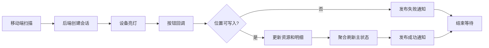

## 背景：一个抽象场景

在现场操作系统里，“交接”通常不是一个单纯的提交按钮。用户可能先扫描资源，再扫描位置；如果现场有智能设备，还会亮灯、等待按钮回调、更新位置、刷新列表、关闭灯光和推送结果。

这条链路同时受到人、移动端、后端和设备事件影响。任何一环没有闭环，都可能出现重复发起、按钮回调丢失、库位被占用后无提示、列表状态刷新慢、灯光没有关闭等问题。


这次实践可以抽象成一个问题：**事件驱动的交接流程里，如何让用户操作、设备回调和后端状态保持同一个节奏？**

## 问题拆解

### 1. 防重不能只靠后端幂等

后端幂等可以保证重复请求不会重复写入，但移动端如果没有防重，用户仍会看到混乱反馈。例如上一件资源还在等待设备按钮确认，用户又扫了下一件；或者接口请求还没返回，页面又发起第二次交接。

移动端需要把“正在请求”和“等待回调”拆成两个状态：

- `requesting`：接口请求还没结束，不能再次提交。
- `waitingCallback`：接口已返回，但还在等待设备或异步事件确认。

这两个状态都应该拦截重复操作，并给出明确提示。

```ts
async function submitHandoff(payload: HandoffPayload) {
  if (requesting || waitingCallback) {
    showRepeatFeedback("上一件正在处理中，请等待确认")
    return
  }

  try {
    requesting = true
    const result = await api.submitHandoff(payload)
    if (result.sessionId) {
      waitingCallback = true
      activeSessionId = result.sessionId
    }
  } finally {
    requesting = false
  }
}
```

这不是为了削弱后端校验，而是让用户在现场知道“系统正在处理”，不要用重复扫描制造更多并发事件。

### 2. 异常回调也要通知页面

设备按钮回调经常被当作成功路径处理：按下按钮，后端更新资源位置，页面收到成功通知。但真实现场里会遇到很多失败分支：

- 目标位置已经有资源。
- 资源标签不存在。
- 当前任务找不到对应记录。
- 目标位置没有配置必要上下文。
- 乐观锁更新失败。

如果这些失败只写日志，移动端就会一直等待“完成”事件。用户看到灯在闪，却不知道为什么流程不往下走。

因此，失败分支也应该发布业务通知，让页面结束等待状态，并把错误说清楚。

```java
private void notifyHandoffError(
        String sessionId,
        String message,
        Long taskId,
        Long resourceId,
        Long slotId) {
    eventPublisher.publish(new HandoffEvent()
            .setSessionId(sessionId)
            .setType("error")
            .setMessage(message)
            .setTaskId(taskId)
            .setResourceId(resourceId)
            .setSlotId(slotId));
}
```

事件驱动流程里，错误不是流程之外的事。错误也必须是事件。

### 3. 状态刷新要尽量聚合

交接成功后，系统通常要刷新主单状态：未开始、进行中、已完成。朴素做法是把整单明细查出来，在 Java 或前端里遍历计算。

当交接动作很频繁时，这会变成不必要的高频查询。更好的方式是让数据库直接返回聚合计数：

```sql
SELECT
  COUNT(*) AS effective_count,
  SUM(CASE WHEN status = :completed THEN 1 ELSE 0 END) AS completed_count,
  SUM(CASE WHEN status IN (:processing, :completed) THEN 1 ELSE 0 END) AS started_count
FROM task_item
WHERE task_id = :taskId
  AND deleted = 0
  AND required_qty > 0;
```

后端拿到三个数字后，就能判断主单状态，而不用每次把全部明细搬回应用层。

## 方案设计

### 移动端：用状态机管理扫描、请求和回调

移动端页面可以把交接流程抽成一个小状态机：

- `idle`：等待扫描。
- `requesting`：正在提交。
- `waitingCallback`：等待设备确认。
- `success`：完成并刷新。
- `error`：失败并允许重试。

```ts
function canScanNext() {
  return state === "idle" || state === "success" || state === "error"
}

function enterWaiting(sessionId: string) {
  state = "waitingCallback"
  activeSessionId = sessionId
}

function clearWaiting() {
  state = "idle"
  activeSessionId = ""
}
```

页面卸载时也要清理等待状态和灯光，避免用户离开页面后还残留一个活跃会话。

### 后端：用乐观锁保护位置写入

位置写入是交接流程的核心副作用。一个位置只能放一个资源，因此更新时必须保证目标位置仍为空。

```java
int updated = slotMapper.update(null, new UpdateWrapper<Slot>()
        .eq("id", slotId)
        .isNull("resource_id")
        .set("resource_id", resourceId)
        .set("qty", qty));

if (updated == 0) {
    notifyHandoffError(sessionId, "目标位置已被占用，请重新选择", taskId, resourceId, slotId);
    return;
}
```

这段逻辑比先查再更新更可靠。先查再更新在并发下会有时间窗口；条件更新则把判断和写入合并成一个原子动作。

### 设备事件：成功和失败都要收尾

设备事件处理完成后，需要统一做几件事：

- 更新资源位置。
- 更新明细状态。
- 聚合刷新主单状态。
- 通知移动端成功或失败。
- 关闭或调整灯光。
- 清理当前会话。




## 关键实现示例

### 用两个标记区分请求中和等待回调

```ts
if (isRequesting || waitingForCallback) {
  showMessage("上一件正在处理中，请等待回调")
  focusScanner()
  return
}

try {
  isRequesting = true
  const data = await submit(payload)
  if (data.requiresCallback) {
    waitingForCallback = true
    activeSessionId = data.sessionId
  }
} finally {
  isRequesting = false
}
```

`isRequesting` 解决的是接口并发，`waitingForCallback` 解决的是事件并发。两个状态不要合并，否则接口返回后到设备确认前这段时间会失去保护。

### 错误分支发布通知

```java
if (resource == null) {
    lightDownCell(deviceId, cellId, sessionId);
    notifyHandoffError(sessionId, "资源不存在，请重新扫描", taskId, null, slotId);
    return;
}

if (targetContextMissing(slot)) {
    notifyHandoffError(sessionId, "目标位置缺少上下文，无法交接", taskId, resource.getId(), slot.getId());
    return;
}
```

这种写法可以让页面在失败时也退出等待状态，并把用户下一步动作说清楚。

### 用聚合结果更新主状态

```java
Map<String, Object> summary = itemMapper.selectStatusSummary(taskId, PROCESSING, COMPLETED);
long effective = number(summary.get("effective_count"));
long completed = number(summary.get("completed_count"));
long started = number(summary.get("started_count"));

TaskStatus status = completed == effective
        ? TaskStatus.COMPLETED
        : started > 0 ? TaskStatus.PROCESSING : TaskStatus.PENDING;

taskMapper.updateStatus(taskId, status);
```

这类聚合适合高频回调场景。它减少了应用层对象构建，也让状态判断更接近数据源。

## 常见坑

### 请求结束后就允许继续扫

如果后端返回的是“已创建会话，等待设备确认”，那么接口结束并不代表业务结束。此时立刻允许继续扫描，会让多个会话交错。

### 失败只写日志不通知前端

事件驱动流程最怕“后端知道失败，前端还在等”。任何会让流程终止的失败分支，都应该有明确通知或可查询状态。

### 只按列表刷新判断完成

移动端分页列表可能滞后，不能只依赖列表刷新判断业务是否完成。关键动作应有会话级事件或详情级状态作为依据。

### 忘记限定可选位置范围

如果现场交接只能进入某类区域，那么选择位置和新建位置都应该在入口层过滤。否则用户选错位置后，后端再拒绝，现场体验会很差。

## 可复用经验

1. 事件驱动流程要区分“请求中”和“等待回调中”。
2. 后端幂等负责数据不重复，前端防重负责现场不混乱。
3. 错误分支也要发布事件，不能只写日志。
4. 位置写入使用条件更新或乐观锁，避免先查后写的竞态。
5. 高频状态刷新优先用 SQL 聚合，减少整单明细回查。
6. 页面离开时要清理灯光、会话和等待状态。

## 总结

现场交接流程的难点，是它不只由一个 HTTP 请求决定。移动端扫描、后端校验、设备回调、位置写入、状态刷新和灯光收尾共同组成了一条事件链。

可靠的设计不是让某一端承担全部责任，而是让每一段都有边界：移动端防重和反馈，后端幂等和乐观锁，设备回调成功失败都通知，状态刷新尽量聚合。这样即使现场连续扫码、按钮回调异常或位置被占用，流程也能及时收口，而不是把用户留在一个“等待中”的黑箱里。

