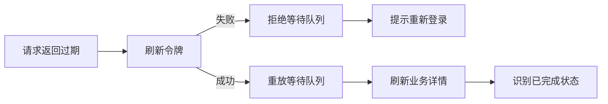

## 背景：一个抽象场景

移动端现场系统经常运行在弱网、重复扫码、多人协作和设备回调交织的环境里。一个动作可能被用户点两次，一个扫码结果可能已经被后台处理过，一个资源可能既属于当前任务，又来自上一轮任务的共享关系。

这类场景下，系统不能只追求“正常路径能跑通”。更关键的是异常路径也要有明确反馈：请求失败不能一直挂起，重复操作不能误报失败，已完成状态要能自动刷新，共享资源要能在正确边界内补建关系。


这次实践可以抽象成一个问题：**在移动端高频操作流程中，如何让重复请求、重复扫描和共享资源分配都保持幂等且可解释？**

## 问题拆解

### 1. 请求队列不能在刷新失败后悬挂

移动端接口层常见做法是：当访问令牌过期时，只允许第一个请求去刷新令牌，其它请求进入等待队列。刷新成功后，队列里的请求用新令牌重放。

问题出在失败路径。如果刷新令牌也失效了，队列里的请求必须被明确 reject。否则页面上的加载状态会一直停着，用户既不知道登录已过期，也无法重新发起操作。

一个可靠的请求层应该同时处理成功和失败两条路径：

```ts
type PendingRequest = {
  config: RequestConfig
  resolve: (value: unknown) => void
  reject: (reason: unknown) => void
}

function flushQueue(error?: unknown, token?: string) {
  const pending = requestQueue
  requestQueue = []

  pending.forEach((item) => {
    if (error) {
      item.reject(error)
      return
    }
    replay(item.config, token).then(item.resolve).catch(item.reject)
  })
}
```

这里的核心是“队列必须有出口”。刷新成功时出口是重放，刷新失败时出口是失败回调和登录过期提示。

### 2. 重复扫描不一定是错误

现场扫码很容易重复发生。用户可能听到提示音后又扫了一次，硬件也可能重复触发。如果后端返回“已处理”“已完成”“无需重复”等信息，前端不应该把它统一渲染成普通错误。

更好的体验是对错误消息做语义分类：

- 重复类：说明动作已经完成，给出温和反馈。
- 非目标类：说明扫错对象，提醒用户换一个。
- 顺序错误类：说明对象不属于当前任务或当前步骤。
- 系统错误类：说明需要重试或联系处理。

```ts
function classifyMessage(message: string): "repeat" | "unknown" | "order" | "error" {
  if (/已处理|已完成|无需重复|重复/.test(message)) return "repeat"
  if (/不存在|未找到|无效/.test(message)) return "unknown"
  if (/不属于当前|不匹配|已被其他任务占用/.test(message)) return "order"
  return "error"
}
```

这不是为了用正则替代后端状态码，而是在既有接口消息不够结构化时，先让移动端反馈更贴近用户动作。

### 3. 已完成记录要能自动刷新

有些操作的完成可能发生在另一个回调里。比如移动端发起亮灯或选择后，后端已经把记录推进到完成状态。此时前端如果继续等待下一步，就会让用户重复操作。

更稳的做法是在关键接口返回后立即刷新详情。如果发现记录已经完成，就直接进入完成反馈，而不是继续打开监控或等待。

```ts
async function selectAndStart() {
  const result = await api.selectResource(buildRequest())

  if (result.recordId) {
    currentRecordId = result.recordId
  }

  await refreshDetail()

  if (detail.status === "success") {
    notifyCompletion()
    return
  }

  startMonitoring()
}
```

幂等设计不是只靠后端“重复提交不报错”，前端也要能识别“这件事其实已经完成了”。

## 方案设计

### 移动端：把失败路径设计成一等公民

请求封装、扫码反馈、完成刷新都属于移动端基础能力。它们不应该散落在每个页面里，而应该有清晰的公共策略：

- Token 刷新期间，请求进入队列。
- 刷新成功，队列统一重放。
- 刷新失败，队列统一失败并提示登录过期。
- 业务消息先分类，再决定反馈样式。
- 关键操作后刷新详情，避免重复等待。



这条链路能解决两个体验问题：页面不会卡死，用户也不会被已完成动作反复要求操作。

### 后端：共享资源补建要区分来源

共享资源分配里，一个资源可能来自直接分配，也可能来自共享组候选，还可能需要在扫码确认时自动补建临时关系。这里最危险的是把所有自动补建都当成同一种来源。

更稳的做法是把补建原因写清楚，并让后续清理逻辑能够识别哪些关系可以移动、哪些关系已经执行不能动。

```java
private void ensureSharedAllocation(
        Long taskId,
        TaskItem item,
        ResourceLabel label,
        String reason) {
    Allocation existing = allocationMapper.selectByTaskAndLabel(taskId, label.getId());
    if (existing != null && existing.belongsTo(item)) {
        return;
    }

    if (existing != null && !existing.canMoveAutomatically()) {
        return;
    }

    allocationMapper.insert(Allocation.builder()
            .taskId(taskId)
            .itemId(item.getId())
            .labelId(label.getId())
            .remark(reason)
            .build());
}
```

`reason` 看起来只是备注，但它能帮助后续判断：这是手动扫码补建，还是智能回调补建；这是可以自动清理的临时关系，还是已经进入执行链路的真实关系。

### 反馈层：把“已占用”纳入顺序错误

现场操作里，“资源已被其它任务占用”通常不是未知错误，而是明确的顺序或归属问题。前端应把它放进当前步骤错误里，提示用户该对象不属于当前操作上下文。

```ts
function shouldTryNextCandidate(message: string): boolean {
  return /不存在|未找到|不属于当前|已被其他任务占用/.test(message)
}
```

这类分类能让多候选尝试更顺畅：当前候选不匹配时，可以继续尝试下一个候选，而不是直接把流程打断。


## 关键实现示例

### 刷新失败时主动 reject 队列

```ts
refreshToken()
  .then((res) => {
    saveToken(res.accessToken)
    flushQueue(undefined, res.accessToken)
    return request(originalConfig)
  })
  .catch(() => {
    const error = "会话已过期，请重新登录"
    flushQueue(error)
    showLoginExpiredConfirm()
    throw error
  })
  .finally(() => {
    isRefreshing = false
  })
```

注意失败时不能只清空数组。只清空数组不会通知原来的 Promise，页面仍然会等着。正确做法是把失败传播给每一个等待请求。

### 用状态刷新替代盲目等待

```ts
const response = await api.startOperation(payload)
currentRecordId = response.recordId || currentRecordId

await refreshRecord()

if (record.status === "completed") {
  playSuccessFeedback()
  return
}

watchOperationResult()
```

这段逻辑的重点是把后端事实拉回来，而不是假设每次都要进入“等待中”。对于现场流程，这种刷新能减少重复扫码和重复确认。

## 常见坑

### 队列只处理成功路径

刷新令牌成功后重放请求很容易想到，但刷新失败后逐个 reject 常常被忽略。只要漏掉这个失败出口，页面就可能出现无法关闭的加载状态。

### 把重复扫码当成失败

重复扫码很多时候表示“动作已经完成”。如果用红色错误提示，会让用户误以为刚才的操作失败，反而继续重复操作。

### 自动补建关系没有来源标记

共享资源的自动补建如果没有来源说明，后续清理逻辑就很难判断它是否可以自动移动或删除。备注、来源类型或创建方式字段都可以承担这个责任。

### 前端只看接口成功，不刷新业务状态

接口返回成功不代表业务仍处于等待态。关键动作后刷新详情，可以把异步回调、重复操作和已完成状态统一收敛到当前页面。

## 可复用经验

1. 请求队列必须同时有成功出口和失败出口。
2. 登录过期提示要防重复弹出，避免多请求同时触发多次确认。
3. 扫码消息要做语义分类，重复、未知、顺序错误不要混成一种反馈。
4. 关键操作后刷新详情，用后端事实判断是否已经完成。
5. 共享资源自动补建要记录来源，方便后续移动、清理和排查。
6. 幂等不仅是“不重复写”，也是“重复操作时给出正确反馈”。

## 总结

移动端现场流程的复杂性，往往来自正常路径之外：令牌过期、重复请求、重复扫码、已完成回调、共享资源归属切换。一个稳定的系统要把这些情况当作常规路径设计。

请求队列要能失败，扫码反馈要能分类，完成状态要能刷新，共享资源补建要有来源。这样即使用户重复操作、网络抖动或状态已经提前完成，系统也能给出清楚、幂等、可恢复的反馈。

