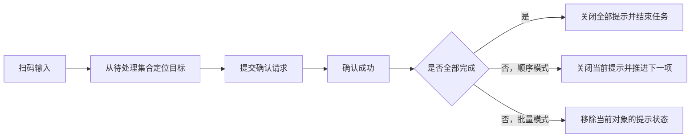

## 背景：一个抽象场景

在现场作业类系统里，移动端经常要同时处理三类信息：用户扫到的唯一标识、后端返回的任务状态，以及现场设备给出的提示状态。最常见的做法，是让移动端按照某个固定顺序处理任务：当前对象亮起提示，用户取走或确认，再切到下一个对象。

但当系统支持另一种“批量提示”模式时，原来的顺序假设就会变得不够用。批量模式下，多个待处理对象可能同时处于可操作状态，用户不一定严格按照列表顺序处理。如果扫码定位仍然强依赖“当前项”，就容易出现明明对象还在待处理集合里，却因为同类对象存在多个位置而被误判为必须扫描更精确标签。


这次实践可以抽象成一个问题：**同一个扫码确认流程，在顺序模式和批量模式下，应该共享哪些规则，又应该在哪些地方允许模式差异？**

## 问题拆解

### 1. 定位规则不能只看条码本身

扫码定位通常有两层匹配：

- 优先使用唯一标签，直接定位到具体对象。
- 如果没有唯一标签，再退化为按通用编码匹配。

在顺序模式下，如果同一个通用编码对应多个待处理对象，移动端要求用户扫描唯一标签是合理的。因为系统需要保证用户处理的是当前提示位置，不能随便选一个。

但在批量模式下，所有待处理对象已经同时被提示出来，用户的真实操作目标不再由“当前索引”决定，而是由“仍未完成的候选集合”决定。此时继续沿用顺序模式的严格规则，会让批量模式失去意义。

### 2. 批量提示不等于整批一起完成

另一个容易忽略的点是状态清理。批量模式下，多个位置可能同时保持提示状态。用户每确认一个对象，系统只应该清理这个对象对应的局部提示状态，而不是把整批提示全部关闭。

如果确认后直接执行全量关闭，会带来两个问题：

- 用户还没处理的对象突然失去现场提示，操作体验被打断。
- 移动端本地状态和设备状态不一致，后续确认容易进入异常分支。

所以批量模式下的完成动作更像是“从活动集合里移除一个成员”，而不是“结束整个会话”。

### 3. 模式差异应该集中在少数决策点

很多流程问题不是因为缺少判断，而是因为判断散落在多个方法里。今天目标定位放宽一点，明天状态清理特殊处理一下，后天硬件回调又补一个分支，最后代码会变得很难推理。

更稳妥的方式是把模式差异压缩到两个决策点：

- 扫码目标定位：同类待处理对象有多个时，批量模式可以选择一个仍未完成的候选对象。
- 完成后推进：顺序模式进入下一个对象，批量模式只清理当前对象的局部提示状态。

这样大部分校验、请求、重复扫码防护和错误反馈仍然可以复用。

## 方案设计

### 移动端：先按唯一标签命中，再做模式感知降级

扫码入口可以保持统一：先把扫码结果拆成候选 token，再从待处理集合里查找唯一标签。只有唯一标签没有命中时，才进入通用编码匹配。

```js
function findScanTarget(scanCode, pendingItems, mode) {
  const tokens = parseScanTokens(scanCode)
  const byLabel = pendingItems.find(item => tokens.has(item.labelCode))
  if (byLabel) {
    return { target: byLabel }
  }

  const code = normalizeCommonCode(scanCode)
  const sameCodeItems = pendingItems.filter(item => item.commonCode === code)

  if (sameCodeItems.length === 1) {
    return { target: sameCodeItems[0] }
  }

  if (sameCodeItems.length > 1 && mode === "batch") {
    return { target: sameCodeItems[0] }
  }

  if (sameCodeItems.length > 1) {
    return { error: "存在多个待处理位置，请扫描唯一标签" }
  }

  return { error: "扫码对象不在待处理集合中" }
}
```

这里的关键不是“随便取第一个”，而是前置条件已经把集合限定在“未完成、未屏蔽、仍可处理”的范围内。批量模式允许从这个集合中取一个候选对象，是因为现场提示已经把多个位置同时暴露给用户，系统不再需要用顺序索引来约束操作。

### 设备联动：用局部清理替代全量关闭

确认成功后，移动端需要根据模式决定后续动作。顺序模式通常要关闭当前提示，再切到下一项并重新亮起；批量模式则应该保留会话，只从待关闭明细中移除当前对象对应的位置。

```js
async function afterConfirmSuccess(options) {
  if (allItemsDone()) {
    await turnOffAllHints()
    completeTask()
    return
  }

  if (options.mode === "batch") {
    removeConfirmedHint({
      groupId: options.groupId,
      positionId: options.positionId
    })
    return
  }

  await turnOffCurrentHint()
  moveToNextCandidate()
  await turnOnCurrentHint()
}
```

这个结构把“任务是否全部完成”和“当前模式如何推进”分开判断。全部完成是全局终态，任何模式都应该关闭提示并提交结束；单个对象完成只是局部状态变化，不能误当成全局结束。


### 状态模型：活动集合比当前索引更重要

顺序模式下，当前索引很好用，因为页面一次只引导用户处理一个对象。但批量模式下，当前索引只能作为展示辅助，不能作为业务真相。真正可靠的状态应该是几个集合：

- 待处理集合：还没有确认完成的对象。
- 活动提示集合：当前仍保持现场提示的对象。
- 已处理集合：已经完成确认，且不应再接受重复扫码的对象。

可以用一个简单流程表示：



当页面以集合为中心建模时，模式差异会自然落在集合操作上：顺序模式移动游标，批量模式删除成员，终态流程清空集合。

## 关键实现示例

下面是一个更贴近工程实现的简化版本，重点是把重复扫码防护、接口确认和模式推进串起来：

```js
async function processScan(scanCode) {
  const pendingItems = getPendingItems()
  const result = findScanTarget(scanCode, pendingItems, state.mode)

  if (!result.target) {
    showScanError(result.error)
    return
  }

  const lockKey = result.target.id
  if (state.activeScanKey === lockKey || state.doneKeys.has(lockKey)) {
    showScanError("请勿重复扫码")
    return
  }

  state.activeScanKey = lockKey
  try {
    const response = await confirmScan({
      itemId: result.target.id,
      scanCode
    })

    const confirmedItem = resolveConfirmedItem(response, result.target)
    markDone(confirmedItem)

    await afterConfirmSuccess({
      mode: state.mode,
      groupId: response.groupId,
      positionId: response.positionId
    })
  } finally {
    state.activeScanKey = ""
  }
}
```

这段代码里有几个可以复用的点：

- 定位目标和提交确认分离，方便按模式扩展定位策略。
- 重复扫码锁在请求前设置，并在 `finally` 中释放，避免异常后页面卡死。
- 确认成功后使用后端返回的位置数据做状态清理，减少前端猜测。
- 推进逻辑通过参数表达意图，而不是在多个方法里读取隐式状态。

## 常见坑

### 1. 把顺序模式的约束带到批量模式

顺序模式强调“当前对象”，批量模式强调“候选集合”。如果批量模式仍然要求用户在同类对象中扫描唯一标签，系统就没有真正支持批量操作，只是一次性把多个提示打开了而已。

### 2. 单个确认后关闭整批提示

批量提示的会话生命周期通常长于单个对象。确认一个对象后，应该只清理它对应的提示明细；等全部对象都完成后，再进入全量关闭和任务完成逻辑。

### 3. 只改前端定位，不改完成推进

如果只放开扫码定位，不调整确认后的状态清理，就会出现“能扫进来，但扫完后现场提示乱掉”的问题。扫码策略和提示状态必须一起设计。

### 4. 用页面展示顺序代替后端确认结果

实际确认对象最好以后端返回为准。移动端可以先用本地集合做候选定位，但最终标记完成、清理提示时，应优先使用接口返回的对象和位置信息，避免弱网、缓存或列表重排造成错位。

## 可复用经验


这类移动端扫码流程，可以总结成几个设计原则：

- 先定义模式语义，再写分支逻辑。顺序模式约束当前项，批量模式约束候选集合。
- 目标定位要有优先级。唯一标签优先，通用编码只能作为受控降级。
- 完成推进要区分局部状态和全局终态。单项完成不等于整批完成。
- 设备状态清理要精确到对象或位置，不要用全量关闭掩盖局部完成。
- 重复扫码锁必须有释放路径，请求失败、接口异常和成功分支都不能留下死锁。

## 总结

移动端扫码流程最容易被写成“扫一下、调接口、改状态”的线性逻辑。但只要系统同时支持顺序处理和批量处理，线性逻辑就不够了。

更稳的设计，是把流程拆成三层：扫码目标定位、后端权威确认、现场提示状态推进。顺序模式和批量模式共享大部分校验与确认逻辑，只在“如何从候选集合中选目标”和“确认后如何清理提示状态”这两个点上体现差异。

这样既能保留顺序模式的精确性，也能让批量模式真正服务于现场效率，而不是被旧的当前项约束拖住。

