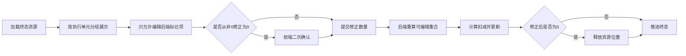

## 背景：一个抽象场景

很多任务流系统都会有一个“终态确认”动作：前面的现场操作已经完成，系统需要在最后一步统一结算资源、更新状态，并把业务单据推进到结束态。这个页面看起来只是一个确认按钮，实际却经常承载最敏感的规则：哪些资源真正参与了执行，剩余数量是多少，是否允许人工修正，修正后又会影响哪些库存或位置状态。

如果终态页只做简单展示，问题会被推迟到后台数据里；如果终态页允许随意编辑，风险又会被转移给用户。更稳妥的方式，是把终态确认设计成一个“可审计的修正工作台”：前端展示清晰来源和可编辑边界，后端重新验证权限与范围，零数量等高风险动作需要二次确认，并在提交后完成资源状态闭环。


这次实践可以抽象成一个问题：**终态确认页如何既允许必要的数量修正，又不让修正动作破坏资源状态一致性？**

## 问题拆解

### 1. 终态页不是普通详情页

普通详情页强调“看清楚”，终态确认页还要支持“改正确”。这意味着页面不能只按单据平铺资源，而要按执行上下文组织信息，让用户能判断每一条资源来自哪里、属于哪个执行单元、当前数量和可修正数量分别是什么。

如果缺少来源信息，用户看到多个相同编码或相同规格的对象时，就很难判断应该修正哪一个。终态页一旦发生误改，后端即使能拦住非法数据，也很难替用户识别“合法但不合理”的操作。

### 2. 扣减量和修正后数量不是同一个概念

很多系统最初会把终态输入设计成“扣减数量”。这对机器计算友好，但对用户不够直观。用户现场看到的通常是“当前还剩多少”，而不是“从原数量里扣掉多少”。

更自然的交互是让用户输入修正后数量，后端再计算扣减量：

```text
deductQty = availableQty - correctedQty
```

这样做有两个好处：

- 前端输入更贴近用户观察到的事实。
- 后端仍然保留统一的扣减模型，不需要让页面理解所有库存细节。

### 3. 可编辑边界必须由后端定义

终态确认页可以隐藏不可编辑项，也可以把未使用资源折叠起来，但这些都只是体验优化。真正的边界必须由后端根据资源事实计算出来，例如是否已经产生扣减、是否属于最后一条有效分配、是否仍在当前终态范围内。

前端可以根据 `editable` 字段决定是否显示输入框，但提交时后端仍要重新计算可编辑集合，防止页面缓存、接口篡改或并发变化带来错误修正。

### 4. 零数量修正是高风险动作

把修正后数量改为 0，并不只是一个数字变化。它通常意味着该资源不再保留当前位置，甚至需要释放占用位置，让后续流程可以重新使用。

所以零数量修正应该被视为高风险动作：

- 前端提交前明确列出受影响对象。
- 用户需要二次确认。
- 后端提交时再次验证该对象确实允许被修正。
- 真正清理位置状态时，只清理当前对象对应的资源和位置。

## 方案设计

### Web：把终态确认拆成独立工作台

终态确认如果放在一个弹窗里，信息密度很容易失控。资源来源、分组、数量、状态、可编辑输入、风险提示都塞进弹窗后，用户很难做出准确判断。

更好的方式是把它拆成独立确认页：

- 列表页负责筛选待结束任务。
- 详情页负责只读查看终态数据。
- 确认页负责展示可编辑资源并提交终态动作。

确认页内部再按执行单元分组，把同类资源折叠到可展开表格中。这样用户先看到整体结构，再展开具体分配记录，既避免页面过长，也让修正动作有上下文。

```ts
interface FinalResourceRow {
  groupId: number
  sourceNo?: string
  resourceCode: string
  availableQty: number
  currentQty: number
  correctedQty: number
  editable: boolean
}
```

前端初始化时，不直接把扣减量暴露给用户，而是把后端返回的当前数量映射成可编辑的修正数量：

```ts
function normalizeResource(row: FinalResourceRow) {
  const currentQty = row.currentQty ?? Math.max(row.availableQty - getDeductQty(row), 0)
  return {
    ...row,
    originalCurrentQty: currentQty,
    correctedQty: currentQty
  }
}
```

这里保存 `originalCurrentQty` 很关键。它可以区分“原本就是 0”与“用户从非 0 改成 0”，后者才需要高风险二次确认。


### 前端：把二次确认建立在差异上

终态提交前，前端只收集可编辑项，并筛出被用户改成 0 的资源。注意判断条件不应该只是 `correctedQty === 0`，否则原本数量就是 0 的记录会反复触发警告。

```ts
function collectCorrectionPayload(rows: FinalResourceRow[]) {
  return rows
    .filter((row) => row.id && row.editable && row.originalCurrentQty > 0)
    .map((row) => ({
      id: row.id,
      correctedQty: Number(row.correctedQty || 0)
    }))
}

function findZeroRiskRows(rows: FinalResourceRow[]) {
  return rows.filter((row) =>
    row.id &&
    row.editable &&
    row.originalCurrentQty > 0 &&
    Number(row.correctedQty || 0) === 0
  )
}
```

这个二次确认不是为了把责任推给用户，而是为了在高风险动作前补一层认知确认：你改的不是普通数量，而是会触发资源位置释放的终态修正。

### 后端：提交时重新计算可编辑集合

后端不能信任前端传来的 `editable`。终态提交时应该重新查询当前任务范围内的资源分配，并重新计算哪些记录允许修正。

```java
Set<Long> editableIds = resolveEditableIds(currentAllocations);

for (CorrectionItem item : request.getItems()) {
    Allocation allocation = allocationMap.get(item.getId());
    if (allocation == null || !belongsToCurrentTask(allocation)) {
        throw invalidParam("修正对象不属于当前终态范围");
    }
    if (!editableIds.contains(item.getId())) {
        throw invalidParam("当前资源不允许修正");
    }

    BigDecimal correctedQty = normalize(item.getCorrectedQty());
    BigDecimal availableQty = resolveAvailableQty(allocation);
    if (correctedQty.compareTo(availableQty) > 0) {
        throw invalidParam("修正数量不能超过可用数量");
    }

    BigDecimal deductQty = availableQty.subtract(correctedQty);
    updateDeductQty(item.getId(), deductQty);
}
```

这段逻辑体现的是一个边界原则：前端负责让用户少犯错，后端负责保证系统不会错。

### 后端：零数量修正要完成资源闭环

当修正后数量为 0 时，仅更新扣减量还不够。资源如果仍然占着现场位置，后续流程会看到一个“数量为 0 但位置仍被占用”的矛盾状态。

因此后端在确认零数量修正后，需要清理对应资源的位置关联：

```java
if (correctedQty.compareTo(BigDecimal.ZERO) == 0) {
    clearResourcePosition(resourceId);
}
```

真正工程实现时，`clearResourcePosition` 不应该只清一个字段，而要同时考虑：

- 资源当前记录上的位置字段。
- 位置表中的占用对象。
- 资源与位置之间的双向引用。
- 是否只作用于当前被修正的资源。

这一步最好和终态提交放在同一个事务里。否则可能出现数量已经修正成功，但位置释放失败的半完成状态。



## 常见坑

### 1. 只在前端限制可编辑

前端隐藏输入框并不等于规则成立。终态提交必须重新查询和验证资源范围，否则接口被重复提交、旧页面缓存提交、并发状态变化时，都可能修改到不该修改的记录。

### 2. 把 0 当成空值处理

数量输入里，`0` 是有明确业务含义的值，不是“没填”。如果用 `value || defaultValue` 之类的写法，0 很容易被默认值覆盖，导致用户明明改成 0，提交时又变回原数量。

### 3. 用扣减数量做用户输入

扣减数量适合系统结算，但不一定适合人工校正。用户更容易理解“当前剩余数量”。让用户输入修正后数量，再由后端换算扣减量，通常更符合终态确认场景。

### 4. 零数量只改数字，不释放位置

如果修正后数量为 0，却没有清理对应位置状态，系统会留下“空资源仍占位”的脏状态。这个问题不会马上暴露，但会在后续分配、查询或现场提示中放大。

### 5. 详情页和确认页共用同一套交互

详情页偏查看，确认页偏操作。两者可以复用数据结构和展示组件，但交互职责应该分开。详情页不应该承担高风险确认动作，确认页也不应该像普通详情一样弱化提交前提示。

## 可复用经验


这类终态确认流程，可以沉淀成一套通用设计清单：

- 终态页先按业务上下文分组，再展示具体资源明细。
- 用户输入尽量贴近现场事实，系统内部字段由后端换算。
- 可编辑边界由后端计算，前端只消费结果。
- 提交时后端必须重新验证资源归属和可编辑性。
- 从非 0 修正为 0 要单独识别，并在前端二次确认。
- 零数量修正要和资源位置释放放在同一个事务闭环里。
- 详情页、确认页、列表页的职责要拆开，避免弹窗承载过多高风险操作。

## 总结

终态确认页的难点不在“把按钮点下去”，而在于它往往是多个状态交汇的最后一站。数量、扣减、资源位置、可编辑规则、用户确认和后端事务，都要在这里收束。

一个可靠的设计，不会把修正能力简单交给前端，也不会把所有判断都藏在后端让用户盲提交。它应该让用户看见足够清晰的上下文，让前端承担风险提示和输入体验，让后端保持权威校验和状态闭环。

当终态确认页具备这种可审计的结构后，数量修正就不再是一个危险的临时入口，而是系统状态一致性的一部分。
