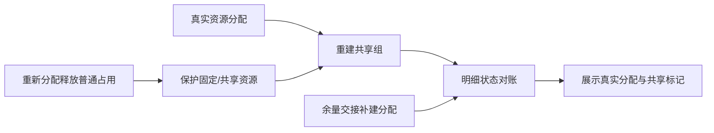

## 背景：一个抽象场景

在复杂任务流系统中，经常会出现多个任务共享同一类资源的场景。资源本身只有一份，但它会影响多个任务的状态：当前任务使用它，后续任务可能继续接收它，终态时还要决定是交接、释放还是回库。

如果系统把“共享关系”和“真实分配记录”混在一起，就容易出现分配漂移：A 任务真实持有的资源显示到 B 任务下，某个任务没有直接分配却被误判为缺料，或者余量交接后状态没有重新计算，导致流程卡在中间态。


这次实践可以抽象成一个问题：**共享资源到底应该影响状态，还是应该复制成多份分配记录？**

## 问题拆解

### 1. 共享关系不是分配记录复制

共享资源的核心不是“给每个任务都造一条相同资源记录”，而是建立一个共享关系：在同一个准备范围、同一执行线、同一资源维度下，多条任务明细共同引用一组共享状态。

真实资源标签或分配记录仍然应该只有一份。其他任务通过共享组判断自己是否被满足，而不是拥有一条伪造的直接分配。

### 2. 展示口径和状态口径不能混用

展示接口通常希望用户看到“当前任务自己的真实分配”。如果为了展示方便，把共享组里其他任务的资源也塞进当前任务列表，用户就会以为这些资源真的属于当前任务。

但状态计算又不能只看当前任务的直接分配。对于共享项，如果没有直接分配记录，需要通过共享组查询其他成员的有效分配，判断当前任务是否应该是共享满足，而不是短缺。

所以这里天然存在两套口径：

- 展示口径：只展示当前任务的真实分配。
- 状态口径：直接分配和共享组分配都要参与判断。

### 3. 余量交接后必须重算明细状态

共享资源在后续交接流程里可能被补建首套分配，或从一个任务流转到另一个任务。如果这一步只新增分配记录，不触发明细状态重算，页面和流程状态仍然会停留在旧判断上。

这就是典型的“数据已经修了，状态没跟着走”。对于共享资源来说，任何会改变真实分配或接收关系的动作，都应该触发共享组重建或明细状态对账。

## 方案设计

### 后端：让共享组成为关系真相

共享关系应该由专门服务维护，分配服务只负责真实资源分配，并在关键节点触发共享组重建和状态对账。

```java
void refreshAllocation(Long taskId) {
    allocateRealLabels(taskId);
    shareGroupService.rebuildByTask(taskId);
    reconcileItemStatuses(taskId);
}
```

这样可以避免多个服务各自维护一套“共享判断”。共享组负责回答“哪些任务共享同一资源关系”，分配记录负责回答“哪些资源真实存在并被占用”。

### 后端：展示接口只返回直接分配

展示接口如果是查看某个任务明细的资源列表，应优先返回该明细自己的直接分配：

```java
List<Allocation> getAllocationsForDisplay(Long itemId) {
    return allocationMapper.selectByItemId(itemId);
}
```

这里不要因为共享组存在，就把其他任务的资源也拼进来。否则会造成两个问题：

- 用户看到的归属不准确。
- 后续编辑、释放或扣减时可能误操作别的任务资源。

共享信息可以通过额外字段展示，比如 `shared`、`sourceTaskNo`、`shareGroupId`，但不要冒充直接分配。

### 后端：状态对账需要查询共享组分配

状态计算则不同。如果当前明细属于共享组，它可以被组内其他真实分配满足。状态对账需要按共享组找出组内成员，再查询这些成员的有效分配。

```java
ItemStatus resolveItemStatus(Item item) {
    if (hasDirectAllocation(item)) {
        return ItemStatus.NORMAL;
    }
    if (item.shareGroupId() != null && hasGroupAllocation(item.shareGroupId(), item.resourceKey())) {
        return ItemStatus.SHARED;
    }
    return ItemStatus.SHORTAGE;
}
```

这段逻辑的重点是：共享状态来自共享组和有效分配的组合，而不是来自某个旧的冲突字段，也不是来自资源编码的简单相等。


### 后端：释放和重分配要保护固定资源

当某个任务重新分配资源时，不能把已经固定的首套资源、已上机资源或共享交接资源一并释放。更稳的做法是先划分集合：

- 受保护资源：已经固定、已接收、已形成共享交接关系。
- 可重分配资源：普通占用、没有进入固定生命周期。
- 可释放标签：不在受保护集合中的真实资源标签。

```java
void releaseReallocatable(Long taskId, List<Allocation> allocations) {
    Set<Long> protectedLabelIds = findProtectedLabels(allocations);
    List<Allocation> reallocatable = allocations.stream()
        .filter(allocation -> !isFixedAllocation(allocation))
        .toList();

    clearAllocations(reallocatable);
    releaseLabels(reallocatable, protectedLabelIds);
}
```

这可以避免“修复分配漂移”时制造新的漂移：为了清理普通资源，把共享或固定资源也误释放。

### 余量交接：补建分配后触发状态重算

当余量交接流程补建首套资源分配后，要立即触发对应明细的状态重算。否则分配记录已经存在，明细仍可能显示短缺或停留在未完成状态。

```java
void handleRemainingHandoff(HandoffResult result) {
    Allocation allocation = ensureFirstAllocation(result);
    if (allocation != null) {
        itemStatusService.recalculate(allocation.getItemId());
        shareGroupService.rebuildByTask(allocation.getTaskId());
    }
}
```

这里的顺序很重要：先保证真实分配存在，再做状态对账。状态对账不应该凭空猜测资源已经到位。



## 常见坑

### 1. 用展示列表驱动状态判断

展示列表为了归属清晰，应该只展示直接分配；状态判断为了业务正确，必须考虑共享组。两者如果混用，要么显示漂移，要么状态误判。

### 2. 给每个共享任务复制分配记录

复制记录看似能让查询变简单，但会带来扣减、释放、交接和展示上的二义性。共享关系应由共享组表达，真实资源分配应尽量保持唯一。

### 3. 只按资源编码判断共享

共享资源的维度通常不止编码，还包括准备范围、执行线、资源 ID 等上下文。只按编码合并，容易把不该共享的任务合在一起。

### 4. 交接后不触发状态对账

余量交接、补建分配、固定资源接收，都会改变状态判断所依赖的事实。只写入记录、不重算状态，很容易让流程卡住。

### 5. 清理分配时不区分固定资源

重新分配前清理旧记录是常见操作，但必须保护已经固定或共享交接的资源。否则修复一个普通分配问题，会破坏已经成立的共享关系。

## 可复用经验


共享资源类流程可以总结出几个稳定规则：

- 共享关系由共享组维护，不靠复制分配记录表达。
- 展示口径只展示真实归属，状态口径可以跨共享组判断满足。
- 分配刷新后要重建共享组，并做明细状态对账。
- 余量交接补建资源后，要立刻触发状态重算。
- 释放旧分配前先划分受保护资源和可重分配资源。
- 不要用单一字段或单一编码替代完整共享维度。

## 总结

共享资源分配漂移，本质上是“关系”和“事实”混在一起造成的。共享组描述关系，分配记录描述事实，展示层描述归属，状态层描述满足情况。四者边界清楚，系统就不容易把别人的资源显示成自己的，也不容易把已经共享满足的明细误判成短缺。

这类问题的修复，不只是改一个查询条件，而是要让关键生命周期都回到同一条闭环：真实分配变化后，重建共享关系；共享关系变化后，重算明细状态；展示时保留真实归属；释放时保护固定资源。
