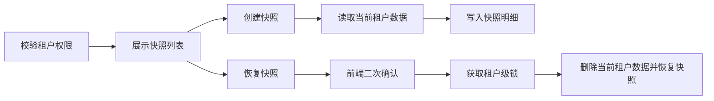

## 背景：一个抽象场景

在业务系统开发和联调过程中，测试环境经常会被反复操作：有人改了基础资料，有人推进了流程状态，有人为了验证异常场景故意制造脏数据。等另一个人接手测试时，现场可能已经不是预期状态，只能手工重新造数据。

如果系统是多租户架构，问题会更复杂。测试人员希望只保存和恢复某个测试租户的数据，而不是影响整套库；同时恢复动作又具有破坏性，必须有权限边界、并发控制和清晰提示。


这次实践可以抽象成一个问题：**如何在多租户系统里，为测试现场提供可控的数据快照能力？**

## 问题拆解

### 1. 快照边界不能等同于全库备份

测试现场快照不是 DBA 级别的全库备份。它更像是一个面向开发测试的局部回滚工具，核心边界应该是当前租户。

因此快照逻辑需要先识别哪些表属于租户数据，再按 `tenantId` 读取当前租户的行。这样既减少快照体积，也避免恢复时误伤其他租户。

### 2. 恢复动作天然高风险

创建快照是只读加写入快照记录，风险相对可控；恢复快照则不同，它通常需要先删除当前租户在业务表中的数据，再把快照数据重新插入。

这意味着恢复必须满足几个条件：

- 只能对允许使用快照功能的租户开放。
- 快照必须属于当前租户。
- 同一租户的创建、删除、恢复不能并发执行。
- 前端必须有二次确认，明确提示会覆盖当前测试数据。

### 3. 表结构会变化

测试快照如果跨版本保存，恢复时可能遇到表已删除、字段已新增、字段类型有变化等问题。工程上很难保证快照永远和当前结构完全一致，所以恢复逻辑要尽量弹性：

- 读取当前仍存在的租户表。
- 快照里有但当前不存在的表可以跳过。
- 插入时按当前表字段构造列集合。
- 对时间、数字、布尔等类型做必要转换。

这样快照能力才不会因为一次小的表结构调整就完全不可用。

## 方案设计

### 后端：把租户边界放在第一层

快照服务的第一步不是查数据，而是判断当前上下文是否允许使用能力。比如只允许测试租户或管理员入口使用，避免普通租户误触。

```java
public boolean canUseSnapshot() {
    Tenant tenant = getCurrentTenant();
    return tenant != null && tenant.isTestTenant();
}

private void checkSnapshotPermission() {
    if (!canUseSnapshot()) {
        throw forbidden("当前租户不允许使用测试快照");
    }
}
```

权限校验之后，所有快照记录都必须绑定当前租户。查询列表、改名、删除、恢复时，也都要重新校验快照归属。

### 后端：按元数据发现租户表

如果手工维护一份表名单，短期简单，长期容易遗漏。更稳的方式是从数据库元数据中找出包含 `tenant_id` 字段的表，然后过滤掉快照自身的存储表。

```java
List<TableMeta> tenantTables = informationSchema.tables().stream()
    .filter(table -> table.hasColumn("tenant_id"))
    .filter(table -> !table.name().startsWith("snapshot_"))
    .toList();
```

创建快照时，对每张租户表执行当前租户范围查询，并把结果序列化成 JSON 存入快照明细表：

```java
for (TableMeta table : tenantTables) {
    List<Map<String, Object>> rows = selectRowsByTenant(table, tenantId);
    saveSnapshotData(snapshotId, table.name(), rows.size(), toJson(rows));
}
```

这里保存 `rowCount` 不只是为了展示，也方便后续排查：如果用户恢复后发现现场不对，可以快速判断某张表在快照时是否本来就没有数据。


### 后端：用租户级锁保护破坏性操作

创建、删除、恢复都围绕同一个租户的数据集合工作。尤其恢复会先清空当前租户数据再插入快照，如果两个操作并发执行，很容易出现半恢复状态。

可以为每个租户维护一个细粒度锁：

```java
private final ConcurrentMap<Long, ReentrantLock> tenantLocks = new ConcurrentHashMap<>();

private ReentrantLock getTenantLock(Long tenantId) {
    return tenantLocks.computeIfAbsent(tenantId, id -> new ReentrantLock());
}
```

恢复时拿到锁后，在事务里完成删除和插入：

```java
lock.lock();
try {
    transactionTemplate.executeWithoutResult(status -> {
        for (TableMeta table : currentTenantTables) {
            deleteRowsByTenant(table, tenantId);
        }
        for (SnapshotTableData data : snapshotTables) {
            restoreRows(data, currentTableMeta);
        }
    });
} finally {
    lock.unlock();
}
```

锁的粒度是租户，而不是全局。这样一个测试租户恢复时，不会阻塞其他租户的普通操作。

### 前端：把快照能力做成低干扰面板

这类能力主要服务开发和测试，不应该打断正常首页使用。因此前端可以在首页增加一个只在可用时显示的管理面板：

- 初始化时调用 `can-use`，不可用就不渲染。
- 可用时加载快照列表。
- 支持创建、重命名、删除、恢复。
- 恢复前弹出明确确认。
- 恢复成功后刷新列表，并提示建议重新登录或刷新页面。

```ts
async function initSnapshotPanel() {
  visible.value = await SnapshotApi.canUse()
  if (visible.value) {
    await loadSnapshots()
  }
}

async function restoreSnapshot(id: number) {
  await confirm("恢复会覆盖当前测试数据，是否继续？")
  restoring.value = true
  try {
    await SnapshotApi.restore(id)
    await loadSnapshots()
  } finally {
    restoring.value = false
  }
}
```

前端不需要理解数据库细节，只要把高风险操作表达清楚，把 loading、禁用状态和列表刷新做好。



## 常见坑

### 1. 只在前端隐藏入口

隐藏按钮不等于权限控制。快照接口本身必须校验当前租户是否允许使用，并且每个快照操作都要校验归属。

### 2. 恢复时没有租户级锁

恢复动作涉及多张表。如果同一个租户同时创建、删除或恢复快照，很容易出现数据不完整。锁不一定要全局，但至少要覆盖同一租户。

### 3. 快照表也被纳入快照

通过 `tenant_id` 自动发现表时，要排除快照元数据表和快照明细表，否则会把快照套快照，恢复逻辑也会变得混乱。

### 4. 把测试快照当成正式备份

测试现场快照强调便捷回滚，不等于灾备。它可以服务联调、演示和复现，但不应该替代正式备份、审计和数据恢复策略。

## 可复用经验


多租户测试快照可以沉淀为几个通用原则：

- 快照范围优先按租户收敛，避免全库级影响。
- 能力入口和接口都要做权限判断。
- 快照归属必须在每次操作时重新校验。
- 恢复动作要有前端二次确认和后端租户级锁。
- 表结构变化要允许跳过或兼容，不要让快照能力过度脆弱。
- 前端面板只暴露操作，不暴露存储实现细节。

## 总结

测试数据快照的价值，不只是少造几次数据。它真正解决的是测试现场不可重复、联调状态难回退、多人操作互相影响的问题。

在多租户系统里实现这类能力，关键是把边界想清楚：按租户保存，按租户恢复，按租户加锁，按租户授权。只要这个边界稳定，快照能力就可以成为开发测试中的一个可靠工具，而不是另一个隐藏风险点。
