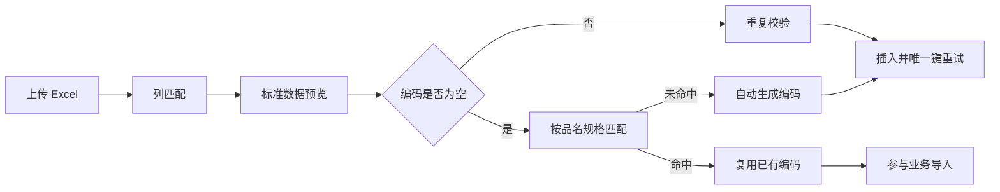

## 背景：一个抽象场景

业务系统里的 Excel 导入经常不是“按模板填好再上传”这么理想。真实文件可能来自客户、供应商、历史系统或手工维护表：列名不统一，物料编码可能缺失，品名规格有时能匹配已有资料，有时又需要自动建档。

如果导入逻辑过于严格，用户会被迫反复修表；如果过于宽松，系统又会产生重复资料、错误明细和不可追溯的编码。更合理的导入链路，是在前端做好列匹配和预览，在后端完成事实校验、自动匹配、自动编码和并发兜底。


这次实践可以抽象成一个问题：**导入功能如何在容错和数据质量之间取得平衡？**

## 问题拆解

### 1. 列名不稳定，需要匹配而不是硬编码

导入模板可以提供标准列名，但实际上传文件未必完全一致。前端可以根据关键词做列匹配，并提供原始数据预览和标准数据预览，让用户在确认前看到系统理解出来的数据。

### 2. 缺失编码不一定是错误

对物料类数据来说，编码缺失可能有两种情况：

- 资料库中已有同品名规格的物料，可以复用已有编码。
- 确实是新物料，需要按客户维度自动生成编码。

如果导入时直接把空编码判失败，就会增加大量手工维护成本。

### 3. 自动编码必须考虑并发

自动生成编码通常会查当前最大序号再加一。单线程里没问题，但多人同时导入时，两个事务可能生成同一个编码。解决方式不能只靠“代码里查一遍”，还要结合锁和唯一键重试。

## 方案设计

### 前端：从原始数据到标准数据

前端导入页可以分成三步：

- 读取 Excel，展示原始数据。
- 根据关键词匹配字段，生成标准数据。
- 对必填项和明显错误做预校验，再提交后端。

```ts
function detectColumns(headers: string[]) {
  return {
    partNo: findHeader(headers, ["物料编码", "part no", "material code"]),
    name: findHeader(headers, ["品名", "物料名称", "name"]),
    spec: findHeader(headers, ["规格", "型号", "spec"]),
    qty: findHeader(headers, ["数量", "用量", "qty"])
  };
}
```

前端预览的价值，不是替代后端校验，而是减少用户盲提交。

### 后端：先按品名规格匹配已有资料

当导入行没有编码时，可以构建一个稳定的匹配键，例如 `品名 + 规格`，在当前客户维度下查找已有物料。

```java
String buildNameSpecKey(String name, String spec) {
    String n = trim(name);
    String s = trim(spec);
    if (n.isBlank() && s.isBlank()) {
        return "";
    }
    return n + "\u0001" + s;
}
```

如果匹配到已有物料，就回填已有编码；如果没有匹配到，再进入自动编码流程。

### 后端：自动编码要有锁和重试

自动编码可以先尝试获取客户维度的命名锁，减少并发生成同一编码的概率：

```java
String lockName = "resource-code:" + tenantId + ":" + customerId;
tryLock(lockName, 5);
```

但锁不是唯一防线。锁失败、超时、异常或分布式部署细节都可能存在，因此插入时还要捕获唯一键冲突并重试下一个编码。

```java
for (int attempt = 1; attempt <= 3; attempt++) {
    try {
        insert(row);
        return;
    } catch (DuplicateKeyException ex) {
        row.code = generateNextCode(customerId, usedCodes);
    }
}
throw new IllegalStateException("自动编码重试过多");
```


### 后端：同批次去重要区分自动匹配行

导入时要检查数据库中已存在的编码，也要检查同批次重复编码。但如果某一行是通过品名规格自动匹配到已有资料，它不应该被当作失败插入，而是作为“复用已有资料”的结果参与后续业务。

```java
if (existingCodes.contains(code)) {
    if (autoMatchedRows.contains(row)) {
        continue;
    }
    fail(row, "编码已存在");
}
```

这样可以避免一个矛盾：系统刚帮用户匹配到已有编码，下一步又因为编码已存在把这行判失败。



## 常见坑

### 1. 前端匹配成功就跳过后端校验

前端列匹配只是提升体验，后端仍然要校验必填项、编码重复、客户归属和业务规则。

### 2. 空编码一律失败

如果系统可以通过品名规格稳定识别已有资料，空编码不一定是错误。关键是匹配规则必须明确，并且限定在正确客户范围内。

### 3. 只靠最大编码加一

并发导入时，“查最大值再加一”很容易撞车。命名锁能降低概率，唯一键重试才是最后兜底。

### 4. 同批重复和自动匹配混为一谈

同批次真的重复插入要拦截；自动匹配到已有资料则应当视为复用，而不是重复创建失败。

## 可复用经验

Excel 导入链路可以按这套模式设计：

- 前端做列匹配、预览和基础校验。
- 后端按客户或业务范围做权威校验。
- 缺失编码先尝试业务键匹配，再自动生成。
- 自动编码使用锁降低并发冲突。
- 唯一索引冲突时自动换号重试。
- 返回结果区分新增、复用、失败，方便用户理解。

## 总结

一个好用的导入功能，不是把 Excel 直接写进数据库，而是把不稳定的表格输入转换成可解释、可校验、可追踪的数据变更。

列匹配解决输入差异，品名规格匹配减少重复资料，自动编码降低手工成本，锁和重试保证并发可靠。把这些环节串起来，导入功能才既宽容，又不失控。
