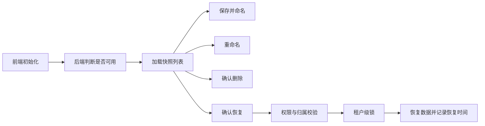

## 背景：一个抽象场景

很多内部工具一开始只是一个接口：保存一份数据、恢复一份数据、清理一份数据。接口能跑通以后，大家会很快遇到第二阶段问题：不知道有哪些记录，不知道哪份刚恢复过，不知道什么时候该删除旧记录，也不知道这个工具到底谁能用。

测试现场快照就是典型例子。它本质上是一个内部数据恢复工具，但一旦进入日常使用，就需要从“接口能力”升级成“操作台能力”：能保存、能命名、能选择、能恢复、能删除、能看到行数和恢复时间，还要有权限和容量边界。


这次实践可以抽象成一个问题：**内部工具如何从可调用接口，变成可长期使用的操作台？**

## 问题拆解

### 1. 内部工具也需要清晰的使用对象

“只有测试租户能用”是一个简单边界，但实际维护时，超级管理员也可能需要协助排查或恢复现场。因此权限模型不能只靠前端入口隐藏，而要由后端能力判断决定：当前租户是否允许使用，当前用户角色是否允许使用。

### 2. 记录列表要提供决策信息

快照列表如果只有名称，用户很难判断哪份有价值。更实用的信息包括：

- 快照名称。
- 表数量和行数量。
- 创建时间。
- 上次恢复时间。
- 当前选中的快照。

这些字段能帮助用户在恢复前做判断。

### 3. 保存数量要有限制

内部工具如果没有容量限制，很容易被当成无限备份使用。测试快照尤其如此，数据可能很大，长期无限保存会影响数据库体积和恢复效率。

所以保存前要检查当前租户已有快照数量，超过限制时拒绝创建，并提示先删除旧记录。

## 方案设计

### 前端：入口可见性由后端决定

前端初始化时先调用 `canUse`。不可用就不渲染面板，避免普通用户看到无意义入口。

```ts
async function initPanel() {
  visible.value = await api.canUse();
  if (visible.value) {
    await loadSnapshots();
  }
}
```

这只是体验层隐藏。真正权限仍然在后端每个接口里校验。

### 前端：把破坏性操作做成显式确认

保存和重命名使用输入框，让用户给现场取一个可识别的名称；删除和恢复则必须确认。

```ts
async function restoreSnapshot() {
  const snapshot = snapshots.value.find(item => item.id === selectedId.value);
  await confirm(`确认恢复到“${snapshot?.name}”？恢复会覆盖当前测试数据。`);
  await api.restore(selectedId.value);
  await loadSnapshots();
}
```

恢复成功后提示刷新或重新登录，因为前端缓存、用户信息和业务页面状态可能还停留在恢复前。

### 后端：权限、归属、容量三层防线

后端接口至少需要三类判断：

- 能力权限：当前租户或角色是否允许使用。
- 记录归属：当前操作的快照是否属于当前租户。
- 容量限制：当前租户快照数量是否超过上限。

```java
Long createSnapshot(String name) {
    Long tenantId = currentTenantId();
    validPermission();

    if (snapshotMapper.countByTenant(tenantId) >= MAX_COUNT) {
        throw badRequest("快照数量已达上限");
    }

    return doCreateSnapshot(tenantId, name);
}
```

归属校验要出现在改名、删除、恢复每个接口里：

```java
Snapshot findOwnedSnapshot(Long snapshotId, Long tenantId) {
    Snapshot snapshot = snapshotMapper.selectById(snapshotId);
    if (snapshot == null || !tenantId.equals(snapshot.tenantId())) {
        throw notFound("快照不存在");
    }
    return snapshot;
}
```


### 后端：恢复后记录最后恢复时间

恢复操作结束后，记录 `lastRestoreTime`。这不是核心业务字段，却非常有用：

- 用户能看到最近恢复的是哪份现场。
- 排查问题时能确认恢复发生的时间点。
- 多人协作时可以减少“谁刚恢复了现场”的沟通成本。

```java
restoreSnapshot(snapshotId);
snapshotMapper.updateLastRestoreTime(snapshotId, now());
```



## 常见坑

### 1. 把内部工具当成不用设计的临时入口

内部工具一旦被多人使用，就需要明确的入口、状态、确认和错误反馈。否则使用成本会转化成沟通成本。

### 2. 只做前端权限

隐藏面板不是安全边界。后端每个接口都必须校验权限和快照归属。

### 3. 不限制快照数量

测试数据也会膨胀。容量限制既保护数据库，也促使用户维护有价值的快照。

### 4. 恢复后不刷新列表

恢复、删除、改名之后都应该刷新列表，保证行数、恢复时间和选中项是最新的。

## 可复用经验

内部数据工具操作台可以按这几个原则设计：

- 可见性由后端能力接口决定。
- 每个写操作都做权限和归属校验。
- 保存记录支持命名和重命名。
- 列表展示创建时间、数据规模和最近恢复时间。
- 删除、恢复这类破坏性动作必须二次确认。
- 设置容量上限，避免工具变成无限数据仓库。

## 总结

内部工具不等于粗糙工具。越是能修改数据、恢复数据、删除数据的工具，越需要清晰的操作台设计。

把快照能力做成可见、可选、可命名、可追踪的面板，本质上是在降低团队使用数据工具的心智负担。接口解决“能不能做”，操作台解决“能不能放心地做”。
