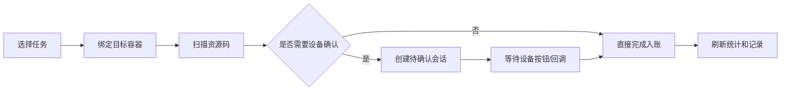

在移动端现场操作系统里，扫码看起来只是一个输入动作，但真实链路往往不止“扫到码 -> 调接口 -> 展示结果”这么简单。

一个典型场景是：用户先选择或扫描目标容器，再连续扫描资源标签；如果目标容器是智能设备，还要等待设备按钮确认或异步回调；如果资源标签已经绑定过业务单据，还要给出上下文；如果扫描失败，也不能让用户误以为已经入账。

这类流程最容易出问题的地方，不是接口写不出来，而是状态边界不清楚：什么时候允许扫下一盘？什么时候应该阻止重复请求？什么时候可以切换目标容器？什么时候必须刷新统计？

## 背景：一个抽象场景

假设有一个移动端收料页面，需要完成下面几件事：

- 按业务单据筛选待处理任务。
- 进入详情后绑定一个目标容器。
- 扫描资源唯一标识，完成收料和发料动作。
- 如果目标容器需要硬件确认，则等待设备事件。
- 页面上展示本次扫描记录、成功失败结果和汇总数量。

流程中同时存在用户输入、接口响应、硬件回调和页面状态刷新。只靠一个 `loading` 很难表达完整状态，需要把流程拆成更明确的状态机。



## 问题拆解

移动端扫码页面常见的问题有四类。

第一类是目标上下文缺失。资源扫进来之前，必须知道它要进入哪个容器、哪个位置、哪个处理节点。如果页面允许在未绑定目标时扫码，后端即使能拦截，也会给用户带来反复失败的体验。

第二类是连续扫码过快。扫描枪或硬件按键可能连续触发，网络请求也可能还没返回。如果没有请求中状态，用户可能把同一个资源扫两次，或者在上一个资源还等待设备确认时扫入下一个资源。

第三类是异步确认悬空。智能容器、货架按钮、外部设备回调并不一定和 HTTP 请求同步完成。前端必须保存“当前等待中的会话”，并在它完成前限制其他操作。

第四类是结果回显不足。现场用户不一定记得刚刚扫了什么，所以需要展示本次扫描记录、失败原因、数量、当前统计，而不是只弹一个很快消失的 toast。

## 方案设计

### 移动端：把页面状态拆小

一个可维护的扫码页面，至少需要区分这些状态：

- `targetId`：当前是否已经绑定目标容器。
- `scanMode`：当前扫的是目标容器，还是资源标签。
- `requesting`：是否存在未完成的扫描请求。
- `activeSessionId`：是否存在等待设备确认的会话。
- `scanRecords`：本次扫描记录，用于现场回溯。
- `summary`：已处理、待处理、异常等统计数据。

这些状态各自表达不同含义，不能互相替代。例如 `requesting=false` 不代表可以继续扫，因为 `activeSessionId` 可能仍然存在。

一个简化后的守卫逻辑可以写成这样：

```js
function canScanMaterial(state) {
  if (!state.targetId) return { ok: false, message: '请先绑定目标容器' }
  if (state.requesting) return { ok: false, message: '上一笔正在处理中' }
  if (state.activeSessionId) return { ok: false, message: '请先完成设备确认' }
  return { ok: true }
}
```

这个例子看起来普通，但它解决了一个核心问题：把“能不能扫”的判断集中起来，而不是散落在按钮禁用、输入框事件、接口调用前后。

### 后端：响应要带足上下文

移动端扫到唯一标识后，后端不能只返回“成功/失败”。更好的响应应该包含：

- 资源是否已绑定。
- 当前数量或累计数量。
- 资源所属任务或来源单据的摘要信息。
- 当前资源的关键展示字段。
- 明确的失败原因。

这样前端才能在本次扫描记录里展示“为什么成功、为什么失败、属于哪个上下文”，避免用户只能靠口头确认。

### 设备协同：用会话表达异步等待

如果扫描动作需要外部设备确认，前端可以把“等待设备确认”建模成会话：

```js
async function handleScan(code) {
  const guard = canScanMaterial(pageState)
  if (!guard.ok) return showTip(guard.message)

  pageState.requesting = true
  try {
    const result = await api.scan(code, pageState.targetId)
    if (result.needDeviceConfirm) {
      pageState.activeSessionId = result.sessionId
      pageState.activePartNo = result.partNo
      return
    }
    appendRecord(result)
    refreshSummary()
  } finally {
    pageState.requesting = false
  }
}
```

这里的关键不是具体字段，而是把异步等待变成页面的一等状态。只要 `activeSessionId` 存在，就不允许继续扫下一笔；设备回调完成后，再清空会话并刷新统计。

## 交互细节

列表页和详情页的职责也要分开。

列表页负责筛选、分页、状态过滤和草稿拦截。比如未发布或未生效的任务，不应该进入扫码详情页，否则用户到了现场才发现不能操作。

详情页负责目标容器选择、扫码模式切换、扫描记录和统计展示。目标容器可以来自手动选择、扫描识别或快速创建，但最终都要落到同一个 `targetId` 上。

这样拆分之后，列表页只回答“这张单能不能进”，详情页只回答“这一盘能不能扫”。

## 常见坑

第一，按钮禁用了，但扫码枪仍然能触发输入事件。移动端防错不能只依赖按钮状态，扫码事件入口也要调用同一套守卫逻辑。

第二，接口失败后忘记恢复状态。`requesting`、扫码模式、输入焦点、定时器都要在失败路径里处理，否则页面会进入“看起来没在加载，但怎么也扫不动”的状态。

第三，设备回调和页面卸载冲突。离开页面时要清理 MQTT 或事件监听，避免旧页面收到新页面的设备事件。

第四，只展示最后一条结果。现场连续扫码时，用户需要看到多条记录和失败原因，否则一旦漏扫或重复扫，很难定位。

## 可复用经验

- 扫码前置条件要集中成守卫函数。
- 请求中状态和异步确认状态要分开。
- 设备确认要有会话 ID，而不是靠页面文案猜测。
- 后端响应要提供足够展示上下文。
- 扫描记录应该包含成功、失败、数量和原因。
- 页面卸载时清理监听器、定时器和输入焦点逻辑。

## 总结

移动端扫码流程的难点，不在于“识别一个码”，而在于把现场操作、后端校验和设备回调放进同一个可控状态机。

当页面能明确回答“当前扫什么、扫到哪、是否等待、能否继续、失败原因是什么”时，扫码功能才真正具备现场可用性。
