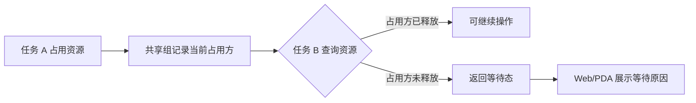

在流程系统里，资源不一定总是“一张单据独占”。有些资源会跨任务、跨节点复用：上一任务还在占用，下一任务已经能看到这份资源，但暂时不能直接操作。

如果系统只用“正常、缺少、已完成”这类简单状态，就很难解释这种中间态。用户看到的是“资源存在”，系统判断却是“不能取”；前端显示成“缺少”，后端又认为它属于共用组。久而久之，状态就会变成一团难解释的灰色地带。

这篇文章整理一种更稳的做法：把“等待上一任务释放”作为显式状态信息，而不是藏在文案或隐式规则里。

## 抽象场景

假设有多个任务共享同一批资源。任务 A 正在使用资源，任务 B 也需要这份资源，但 B 必须等 A 完成释放后才能继续。

这时系统里至少有三种事实：

- 资源属于一个共享组。
- 当前占用方不是当前任务。
- 当前占用方尚未释放，或者释放结果还没有被当前任务接收。

如果只给前端一个 `status=shared`，前端不知道它是“可用的共用”，还是“等待中的共用”。如果只给一个字符串原因，后端又很难让其他流程复用同样判断。

更合理的接口契约应该同时提供结构化状态和展示原因。



## 为什么不能只靠前端判断

前端确实能根据一些字段推断状态，例如是否有共享组、是否有位置、是否有资源码。但这种推断有两个问题。

第一，信息不完整。前端拿到的通常是当前任务视角的数据，不一定知道共享组里所有任务的分配和释放情况。

第二，规则会漂移。Web 端、PDA 端、导出接口、详情接口都可能各写一套判断，最后出现同一资源在不同端显示不同状态。

所以后端需要输出明确字段，例如：

```ts
interface SharedResourceView {
  shared: boolean
  canOperate: boolean
  waitingPreviousTask: boolean
  sourceTaskId?: number
  sourceTaskNo?: string
  waitReason?: string
}
```

前端依然可以做展示映射，但不应该重新发明核心业务判断。

## 后端：把等待态变成可计算结果

后端判断等待态时，可以按下面顺序组织逻辑：

1. 资源是否属于共享组。
2. 当前任务是否已经有自己的直接分配。
3. 共享组当前占用方是否是当前任务。
4. 当前占用方是否已到达释放状态。
5. 共享组内是否存在可覆盖当前任务需求的资源分配。

一个简化后的伪代码如下：

```java
SharedState resolveSharedState(TaskItem item, ShareGroup group) {
    if (item.shareGroupId() == null) {
        return SharedState.normal();
    }
    if (item.hasDirectAllocation()) {
        return SharedState.available();
    }
    if (group.currentTaskId().equals(item.taskId())) {
        return SharedState.available();
    }
    if (!group.currentTaskReleased()) {
        return SharedState.waiting(group.currentTaskId(), "共享资源仍在上一任务中");
    }
    return group.covered(item) ? SharedState.available() : SharedState.shortage();
}
```

这里最重要的是：等待态不是一个文案，而是一个计算结果。它能同时驱动状态、操作权限和展示信息。

## 覆盖判断：不要重复计算同一份资源

共享资源还有一个容易被忽略的问题：同一个资源标签可能在共享组内被多个任务引用。如果按任务明细简单求和，可能会把同一份实物算多次。

比较稳的方式是先构造资源唯一键，再做去重聚合：

```java
Map<String, BigDecimal> qtyByResource = allocations.stream()
    .collect(Collectors.toMap(
        allocation -> allocation.resourceKey(),
        allocation -> allocation.availableQty(),
        BigDecimal::max
    ));

BigDecimal availableQty = qtyByResource.values().stream()
    .reduce(BigDecimal.ZERO, BigDecimal::add);
```

这个模式适用于很多库存、资产、凭证类系统：只要一个业务对象可能被多条关系引用，就要先问“真实资源的唯一键是什么”，再问“业务行需要多少”。

## Web 与 PDA：展示同一个事实

等待态一旦成为接口字段，Web 和 PDA 的展示就可以统一。

Web 管理端适合展示更完整的解释，例如共享组、来源任务、等待原因、当前是否可操作。它解决的是管理人员的可解释性。

PDA 移动端适合展示更短的状态，例如“等待共用资源”“上一任务未释放”“暂不可取”。它解决的是现场用户的行动指引。

两端文案可以不同，但必须来自同一个结构化事实。否则一个端显示“缺少”，另一个端显示“共用”，现场就会很难判断到底该找料还是等释放。

## 常见坑

第一，把等待态写进字符串匹配。例如前端判断原因里是否包含某几个字。这种方式很脆弱，后端文案一改，前端逻辑就可能失效。

第二，把共享组状态等同于资源可用。属于共享组只能说明“资源关系存在”，不能说明“当前任务可以操作”。

第三，忽略直接分配。当前任务如果已经有自己的明确分配，就不应该继续被上一任务等待态阻塞。

第四，数量覆盖不去重。同一个资源被多条共享关系引用时，必须按真实资源去重后再统计可用量。

## 可复用经验

- 中间态要结构化，不要只放在文案里。
- 后端拥有共享组和释放状态的权威判断。
- 前端负责映射展示，不负责重新推导核心状态。
- 共享资源计算要先去重，再汇总。
- `canOperate` 和 `waitReason` 应该一起返回。
- Web 端解释原因，PDA 端给出行动指引。

## 总结

跨任务共用资源的核心，不是“共享”两个字，而是共享过程中每个任务所处的位置：谁正在占用，谁可以操作，谁必须等待。

把等待态建模成明确的接口契约之后，后端状态、Web 展示和移动端操作才能对齐。系统不再只是告诉用户“不能做”，而是能说明“为什么不能做，以及什么时候能做”。
